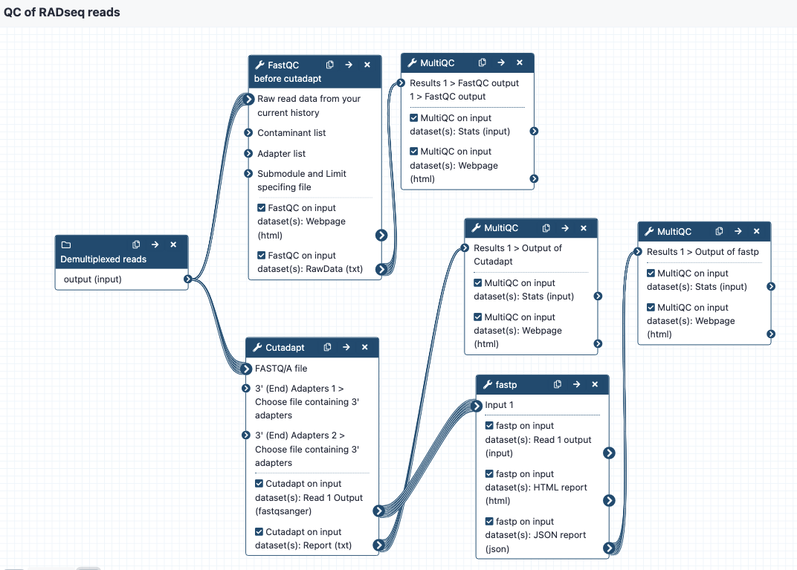

# QC of RADseq reads CWL Workflow Report

### Metadata
- **Docker Image**: N/A
- **Homepage**: https://usegalaxy.org.au/
- **Package**: https://workflowhub.eu/workflows/346
- **Validation**: N/A

- **RO-Crate download**: https://workflowhub.eu/workflows/346/ro_crate?version=1
- **Conda**: N/A
- **Total Downloads**: 685
- **Last updated**: 2023-01-30
- **GitHub**: N/A
- **Stars**: N/A
- **Version**: 1
- **License**: Apache-2.0
- **Workflow type**: Galaxy
- **Main workflow (WorkflowHub):** `Galaxy-Workflow-QC_of_RADseq_reads.ga` (Main Workflow)
- **Project**: Galaxy Australia
- **Views**: 8245
- **Creators**: Anna Syme

## Description

# workflow-qc-of-radseq-reads

These workflows are part of a set designed to work for RAD-seq data on the Galaxy platform, using the tools from the Stacks program. 

Galaxy Australia: https://usegalaxy.org.au/

Stacks: http://catchenlab.life.illinois.edu/stacks/

## Inputs
* demultiplexed reads in fastq format, in a collection
* two adapter sequences in fasta format, for input into cutadapt

## Steps and outputs

The workflow can be modified to suit your own parameters. 

The workflow steps are:
* Run FastQC to get statistics on the raw reads, send to MultiQC to create a nice output. This is tagged as "Report 1" in the Galaxy history. 
* Run Cutadapt on the reads to cut adapters - enter two files with adapter sequence at the workflow option for "Choose file containing 3' adapters". The default settings are on except that the "Maximum error rate" for the adapters is set to 0.2 instead of 0.1. Send output statistics to MulitQC, this is "Report 2" in the Galaxy history. Note that you may have different requirements here in terms of how many adapter sequences you want to enter. We recommend copying the workflow and modifying as needed. 
* Send these reads to fastp for additional filtering or trimming. Default settings are on but can be modified as needed. Send output statistics to MultiQC, this is "Report 3" in the Galaxy history. 
* The filtered and trimmed reads are then ready for the stacks workflows. 

