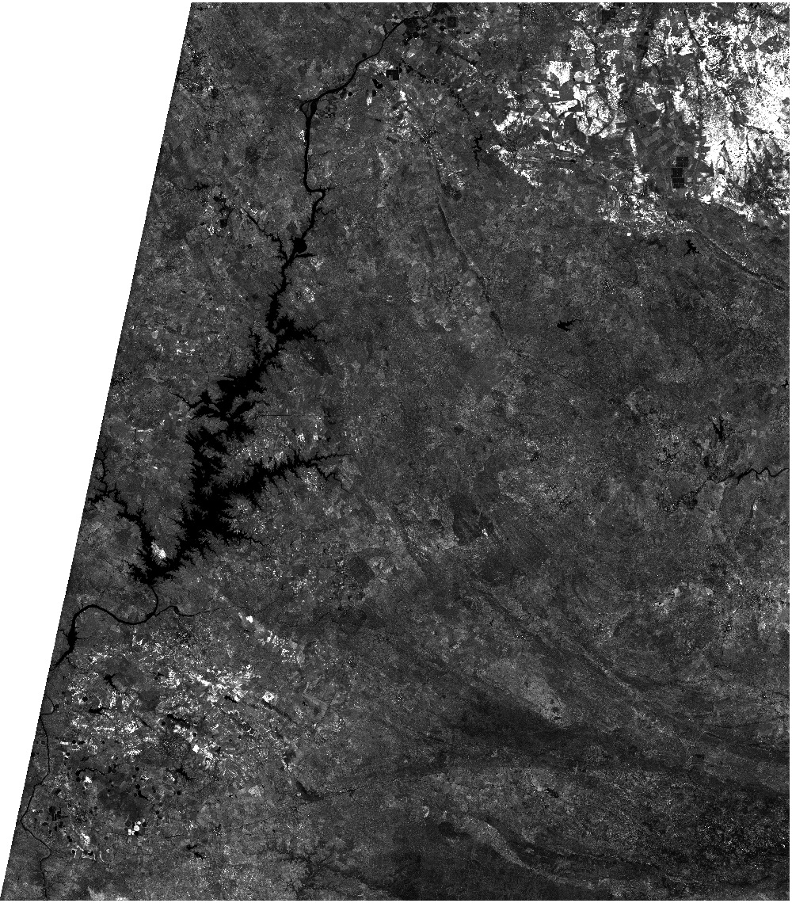
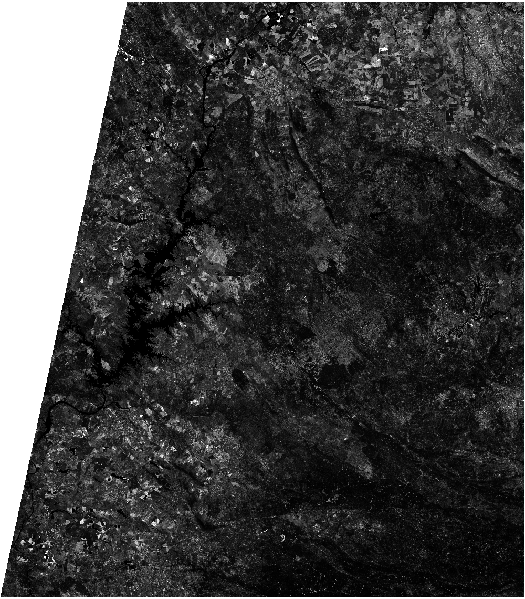
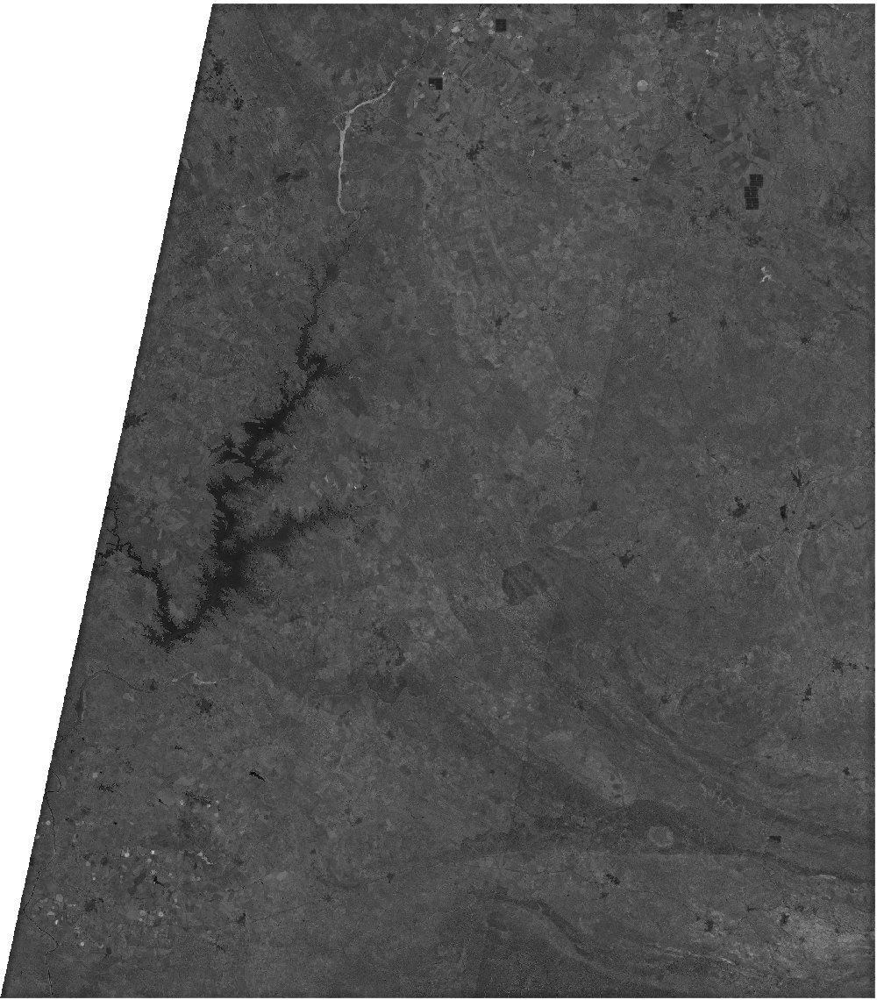
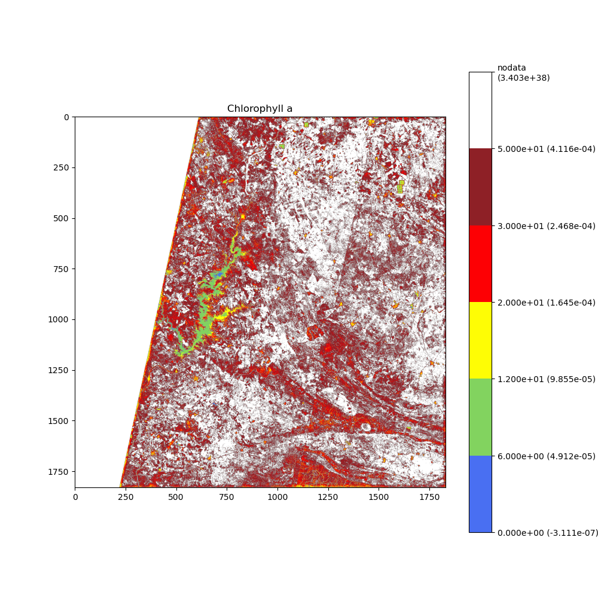
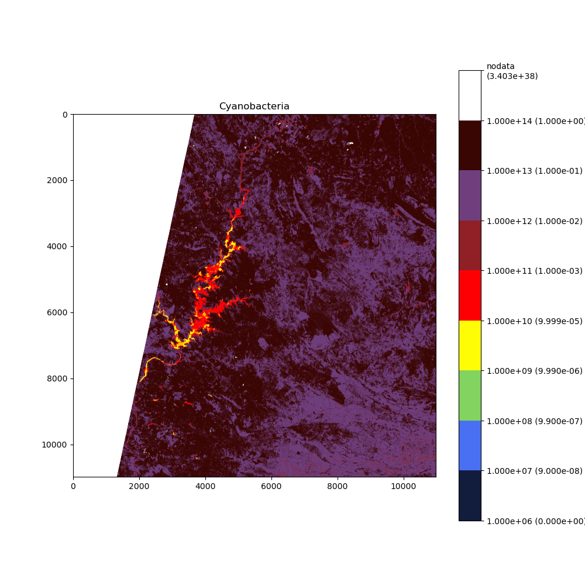
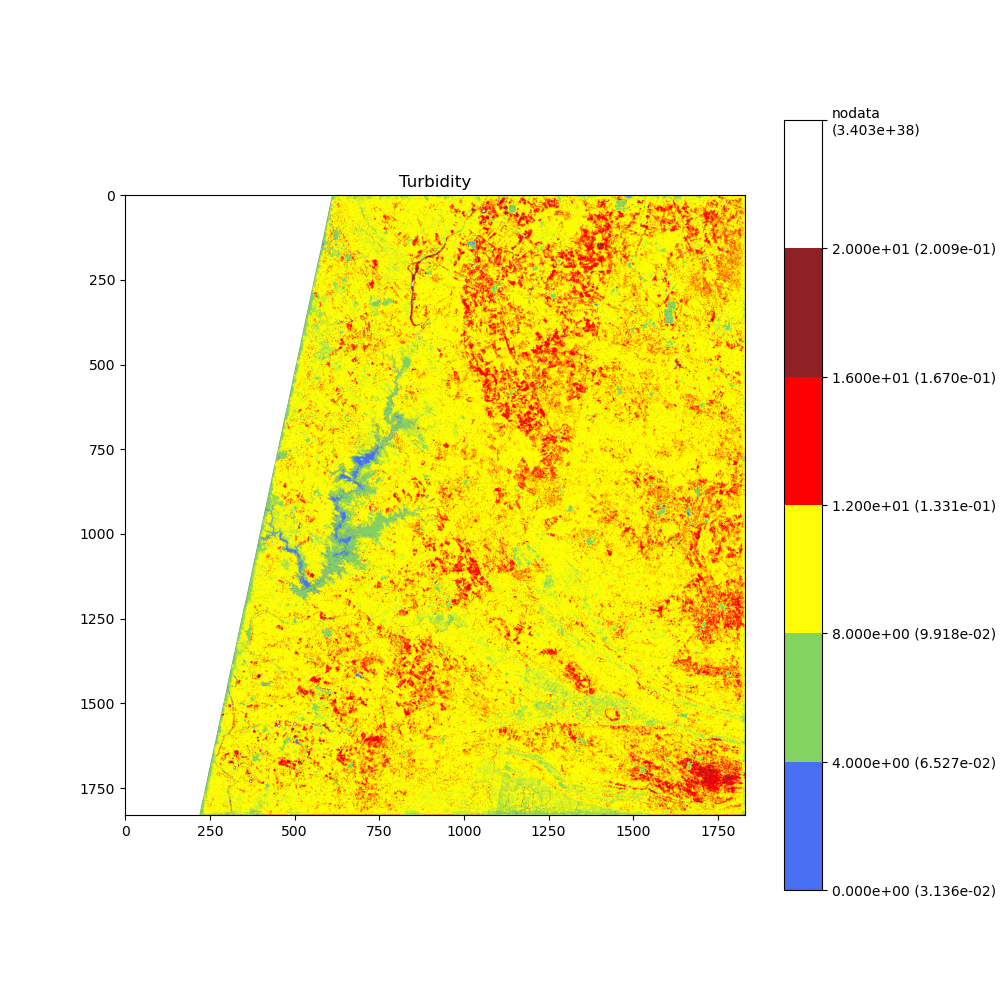

# OGC Application Package for Algae Use Case

This code provides *OGC API - Process* deployable CWL workflow and application definitions to replicate the code
provided in [s2_water_monitoring.ipynb](../s2_water_monitoring.ipynb).

## Build Dockers

To run the workflow locally, ensure the Dockers are built beforehand.
In the event where the CWL *OGC Application Package* would be deployed to a *OGC API - Process* server, these Dockers
would need to be published to an accessible Docker registry.

```shell
cd ogc-ospd/OSPD/algae_usecase/ogc_app_pkg
docker-compose build
```

## Run the Workflow

### Setup

```shell
pip install cwltool
```

### Execution

Prepare your job definition (i.e.: input parameters).
The default [example/algae-usecase-job-copernicus.yml](example/algae-usecase-job-copernicus.yml)
file uses the same values taken from the original notebook.

#### Execution with Copernicus portal

> **NOTE** <br>
> The Copernicus workflow requires valid S3 credentials to access Sentinel-2 products.
> Adjust the corresponding parameters in
> [example/algae-usecase-job-copernicus.yml](example/algae-usecase-job-copernicus.yml) with your
> own credentials, which can be obtained by following steps in
> [Copernicus - User registration and authentication](https://documentation.dataspace.copernicus.eu/Registration.html).

```shell
cwltool "algae-usecase-workflow-copernicus.cwl" "example/algae-usecase-job-copernicus.yml" --outdir /tmp
```

This execution workflow will search for the relevant products using filtering criteria on the Copernicus catalog,
download the respective matched bands required for the calculations, and generate the results for `chlorophyll_a`,
`cyanobacteria` and `turbidity` evaluation. For each case, the raw data will be returned, along a color map for
better visualization and a summary plot representation of the color-map scale values.

A sample output of the above execution is provided
in [algae-usecase-workflow-copernicus.log](example/algae-usecase-workflow-copernicus.log).
Note that paths will differ slightly when executed on your own machine.

#### Execution with Earth-Search portal

Alternatively, the Earth-Search portal allows retrieval of corresponding Sentinel-2 products without credentials.

```shell
cwltool "algae-usecase-workflow-earth-search.cwl" "example/algae-usecase-job-earth-search.yml" --outdir /tmp
```

Contrary to the Copernicus case, Earth-Search uses a STAC catalog to search for available products. Available bands are
also slightly different based on resolution. Therefore, the workflow applies some reprojections in necessary cases to
allow calculations over bands of corresponding dimensions and resolutions. Following download and reprojection, the same
steps as the Copernicus workflow for raw data, color map and plot visualization outputs are performed.

#### Workflow Results

With either the Copernicus or the Earth-Search catalogs, and using the corresponding search inputs provided in the
[example](example) directory (see [Copernicus Job](example/algae-usecase-job-copernicus.yml)
and see [Earth-Search Job](example/algae-usecase-job-earth-search.yml)), the results images should be similar
to the following examples.

> **NOTE** <br>
> There could be minor differences due to reprojection and file names according to how each catalog
> defined their products.

These images are available under the [example](example) directory. The first row corresponds to the "*raw data*"
outputs and the second are the plot visualization with applied mapping of color scale.

> **NOTE** <br>
> Provided images for "*raw data*" below are in JPG format with rescaled values and lower resolution for display
> purpose only. The actual images obtained from the workflow will be GeoTiff with full 32-bits range of values
> and resolution, for which the min/max differ for each calculation.

| chlorophyll_a                                                                                                          | cyanobacteria                                                                                                          | turbidity                                                                                                          |
|------------------------------------------------------------------------------------------------------------------------|------------------------------------------------------------------------------------------------------------------------|--------------------------------------------------------------------------------------------------------------------|
|       |       |       |
|  |  |  |
