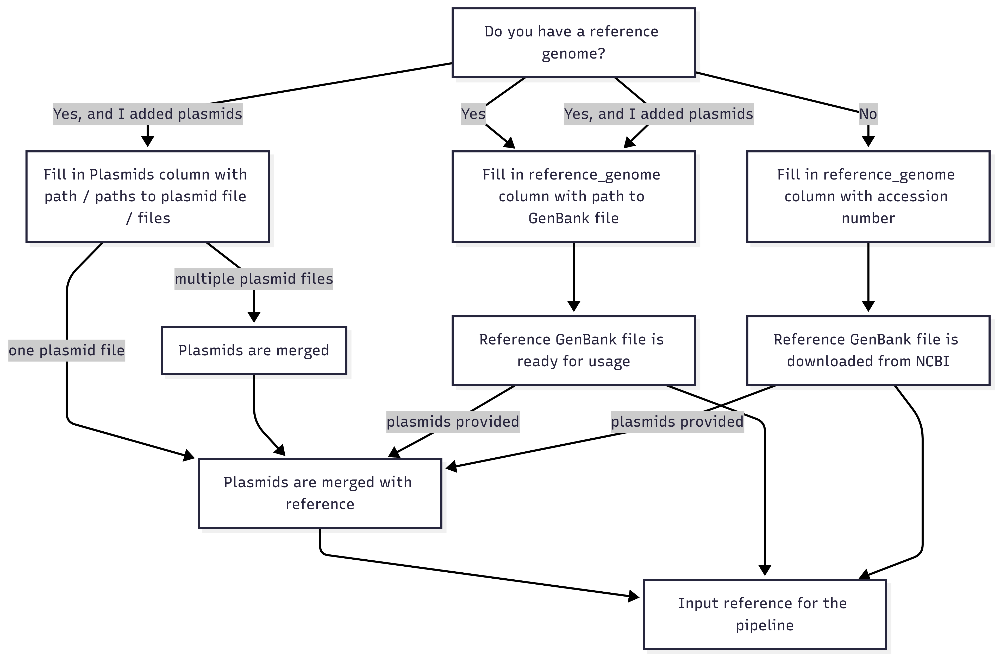
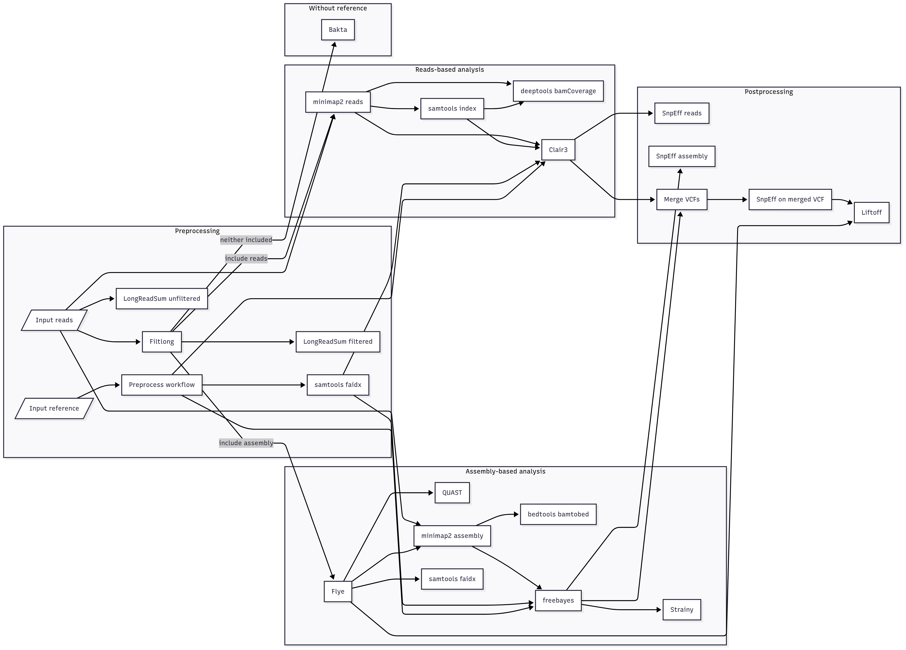
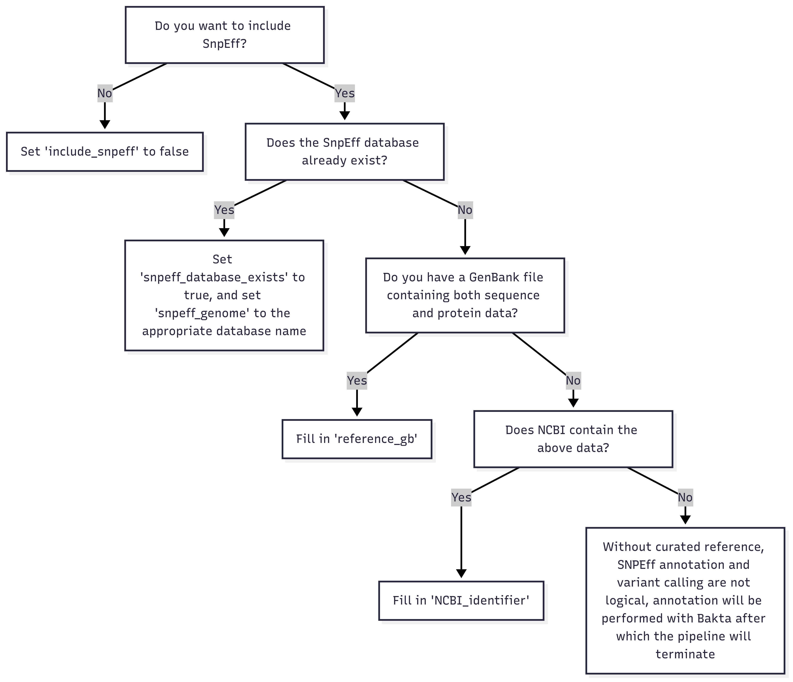

# Sequence data automated analysis

This project contains a CWL (Common Workflow Language) pipeline to gain insight on mutations accumulated in engineered microbial strains. It is registered to [WorkflowHub](https://workflowhub.eu/workflows/1868).

## CWL structure

The [`workflows` folder](./workflows/) consists of two files, the main pipeline [`ADA`](./workflows/workflow_ada.cwl), and a [pre-processing workflow](./workflows/workflow_preprocess_reference.cwl) which is a subworkflow of this main pipeline.

### Pre-process workflow
> Workflow for pre-processing the reference file. Downloads the GenBank file from NCBI if not provided, concatenates plasmid GenBank file(s) with each other and the reference file.

This workflow needs either a reference GenBank file, or a reference accession number. It optionally accepts any amount of plasmids. The steps are as follows:

-When a GenBank file is not provided, it is downloaded from NCBI based on a accession number.  
-When multiple plasmid GenBank files are provided, they are merged into one file.  
-When any amount of plasmid GenBank files are provided, the reference is merged with the plasmid GenBank file(s) into one file. A FASTA file is also extracted.  
-When no plasmid Genbank files are provided, a FASTA file is extracted from the reference GenBank file.  
-A GFF3 file is extracted from the final GenBank file.  
-The final step determines the relevant outputs.  

Refer to the flowchart below to tailor your inputs in the Sample sheet of the workflow excel.


### Main workflow
> Workflow for long read quality control, contamination filtering, assembly, variant calling and annotation.



This workflow includes quality control by LongReadSum, both pre-and post filtering by filtlong, the reference is indexed with samtools. The pipeline splits into two branches, reads-based and assembly based. 
- The reads-based branch maps with minimap2, indexes the mapped reads with samtools, creates a coverage track with deeptools bamCoverage, uses Clair3 for variant calling, unzips its output, and SnpEff for variant annotation if the assembly branch is not performed.
- The assembly-based branch assembles with Flye, does quality control with QUAST, does mapping with minimap2, converts to BED with bedtools bamtobed, indexes both the assembly and the mapped assembly with samtools, uses freebayes for variant calling, optionally performs strainy, and performs SnpEff for variant annotation if the reads branch is not performed.
- When both branches are active, the variants from both branches are merged and SnpEff is performed on this merged output. Optionally, annotations are lifted over to the assembly with Liftoff.
- When neither branch is active, Bakta is performed and the pipeline then terminates.
- Finally, all output is gathered into a logical folder structure.

The main workflow requires sequencing input reads, as well as a reference GenBank file or accession number. Optionally plasmids can be added, type of the reads can be set (only Nanopore has been tested so far and that's what it defaults to), and the sample name can be set (defaults to the name before the extention of the input reads).
It is possible to skip quality control pre and/or post filtering, to exclude reads-based or assembly based mapping and variant calling, or to exclude SnpEff annotation. It is also possible to include Strainy phasing or Liftoff annotation transfer.

You can specify certain parameters of LongReadSum, Filtlong, Flye, Clair3, freebayes, and SnpEff. To see all input parameters, use the command `cwltool workflows/workflow_ada.cwl -h` in an environment with cwltool installed.

Refer to the flowchart below to see what inputs need to be set for SnpEff.




#### Workflow scripts
The script [create_configuration_file.py](scripts/create_configuration_file.py) needs to be run with a filled in input excel sheet containing metadata of the experiment (for a template, see `ADA_template.xlsx`). It automatically creates configuration `.yaml` files in a folder called `yaml_inputs` to be used as the input files for the main pipeline.  
The script [generate_summary_excel.py](scripts/generate_summary_excel.py) creates a summary excel file in the output folder of the main pipeline.  
The Markdown files contain JavaScript based [Mermaid](https://mermaid.js.org/) tools to generate diagrams. 

#### Additional scripts
The script [bp_genbank2gff3_fixed.pl](tools/scripts/bp_genbank2gff3_fixed.pl) converts a GenBank file to a GFF3 file for usage in Liftoff.  
The script [combine_variant_calling.py](tools/scripts/combine_variant_calling.py) merges the variant calling output of freebayes and Clair3.  
The script [genbank_to_fasta.py](tools/scripts/genbank_to_fasta.py) extracts a FASTA file from a GenBank file.  
The script [merge_genbank.py](tools/scripts/merge_genbank.py) merges multiple GenBank files.  

### Example usage
There are multiple ways to run the workflow. You can run the workflow directly with CWL, which requires some setup. The alternative would be to run through [Galaxy](#galaxy), which is much easier as everything is already pre-configured.

#### CWL
A commonly used runner for CWL is [cwltool](https://github.com/common-workflow-language/cwltool/), which also requires using [Docker](https://docs.docker.com/get-docker/). It is possible to run the workflow locally but when scaling up using a server is advisable.

To execute the workflow, clone the git repo, have Docker running, and execute the workflow with your configuration YAML file (which can be created with [the config script](scripts/create_configuration_file.py)).

A [test YAML file](tests/workflows/workflow_ada_example.yaml) is provided using downloadable open data. It uses an assembled genome (Nanopore) of an *E. coli* Q5 strain [found on EBI](https://www.ebi.ac.uk/ena/browser/view/SRX20598581), as well as the [NCBI identifier of this strain](https://www.ncbi.nlm.nih.gov/nuccore/CP127255.1). This test run could be used as follows:

```sh
cwltool --outdir test_dir cwl/workflows/workflow_ada.cwl cwl/tests/workflows/workflow_ada_example.yaml
```

After this, the summary script can be used to create the summary excel file:

```sh
cd outdir && python ../cwl/tools/scripts/generate_summary_excel.py
```

#### Galaxy
Alternatively, for WUR users, a Galaxy instance with this workflow is already running and can be accessed at UPCOMING_LINK.  
In galaxy, go to Tools, then Local Tools, and pick one of the Workflow options. Generally, the YAML option will not be very useful since it will only work with downloadable data (such as the [test YAML file](tests/workflows/workflow_ada_example.yaml)). The manual option requires you to fill in the input data (at the very least the input FASTQ and a reference, GenBank file or NCBI identifier), then you can run the workflow and download the output folder. This output folder will already contain the summary excel so there is no need to run the script manually.

##### Internal structure
Galaxy is hosted at SSB servers, and its configuration can be found [in our internal git](https://git.wur.nl/ssb/galaxy). The .xml files in the [`ada_tools` folder](https://git.wur.nl/ssb/galaxy/-/tree/main/ada/ada_tools?ref_type=heads) are used within Galaxy to create the local tools.

### Outputs

After running the pipeline, your output folder will contain the following files (depends on on settings, this example contains mostly default output):

```
.
├── pipeline_summary.xlsx                                           # Overall run summary excel file
├── freebayes_output.vcf                                            # Freebayes VCF file
├── merge_output.vcf                                                # Unzipped Clair3 VCF file
├── combined_output.vcf                                             # Clair3 and freebayes merged VCF file
├── YOUR_SAMPLE_NAME_assembly.bam(.bai)                             # Mapped assembly (and index) files
├── YOUR_SAMPLE_NAME_reads.bam(.bai)                                # Mapped reads (and index) files
├── <reference>.fasta(.fai)                                         # (Merged) reference sequence (and index) files
├── <reference>.gb                                                  # (Merged) reference GenBank file
├── <reference>.gff3                                                # (Merged) reference GFF3 file
├── YOUR_SAMPLE_NAME.bw                                             # Coverage track BigWig file
├── YOUR_SAMPLE_NAME.bed                                            # Annotation BED file
│
├── QUAST_output/                                                   # Assembly quality control folder
│   ├── report.html
│   ├── report.pdf
│   ├── genome_stats/
│   │   ├── assembly_gaps.txt
│   │   └── genome_info.txt
│   └── ...
│
├── bakta_output/                                                   # Bakta output folder (only when no reference given)
│   ├── assembly.gff3
│   ├── assembly.tsv
│   ├── assembly.png
│   └── ...
│
├── clair3_output/                                                  # Clair3 output folder
│   ├── pileup.vcf.gz(.tbi)
│   ├── full_alignment.vcf.gz(.tbi)
│   ├── merge_output.vcf.gz(.tbi)
│   └── ...
│
├── flye_output/                                                    # Assembly output folder
│   ├── assembly.fasta
│   ├── assembly_info.txt
│   └── ...
│
├── filtlong_output/                                                # Filtering output folder
│   ├── YOUR_SAMPLE_NAME.fastq.gz
│   └── YOUR_SAMPLE_NAME.filtlong.log
│
├── longreadsum_filtered_output/                                    # Filtered quality control folder
│   ├── FASTQ_summary.txt
│   ├── FASTQ_details.txt
│   └── YOUR_SAMPLE_NAME_filtered_read.html
│
├── longreadsum_unfiltered_output/                                  # Unfiltered quality control folder
│   ├── FASTQ_summary.txt
│   ├── FASTQ_details.txt
│   └── YOUR_SAMPLE_NAME__unfiltered_read.html
│
├─── snpeff_merged_output/                                          # SnpEff output folder
│   ├── snpEff_summary.html
│   └── snpeff_output.vcf
│
├─── strainy_output/                                                # Optional strainy output folder
│   ├── alignment_phased.bam(.bai)
│   ├── alignment_phased_merged.bam(.bai)
│   ├── strain_variants.vcf
│   ├── strain_unitigs.gfa
│   ├── strain_contigs.gfa
│   ├── multiplicity_stats.txt
│   └── ...
│
└─── logs/                                                          # Provenance folder
    ├── flye.log
    ├── longreadsum_filtered.log
    └── longreadsum_unfiltered.log

```