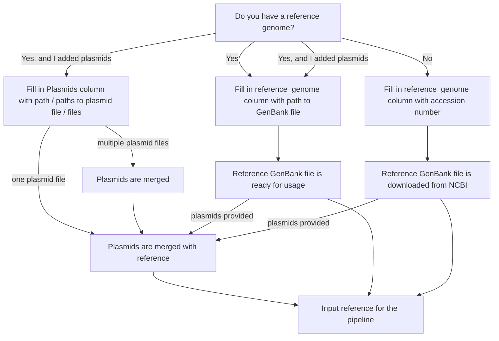

```mermaid
graph TD;
    A[Do you have a reference genome?] -->|Yes| B[Fill in reference_genome column with path to GenBank file]
    %% this is linked to inputs.reference_file, used in the subworkflow

    A -->|No| D[Fill in reference_genome column with accession number]
    %% this links to inputs.accession_number in subworkflow

    A -->|Yes, and I added plasmids| B
    A -->|Yes, and I added plasmids| C[Fill in Plasmids column with path / paths to plasmid file / files]
    %% plasmid files are linked to inputs.plasmids, whether one or more inputs is then handled internally

    C -->|multiple plasmid files| H[Plasmids are merged]
    C -->|one plasmid file| K
    H --> K[Plasmids are merged with reference]
    K --> G
    B --> F[Reference GenBank file is ready for usage]    
    F --> |plasmids provided| K
    D --> I[Reference GenBank file is downloaded from NCBI]
    I --> |plasmids provided| K
    F --> G[Input reference for the pipeline]
    %% outputs are linked to preprocess_reference/fasta_final, preprocess_reference/genbank_final, and preprocess_reference/gff3
    I --> G
```