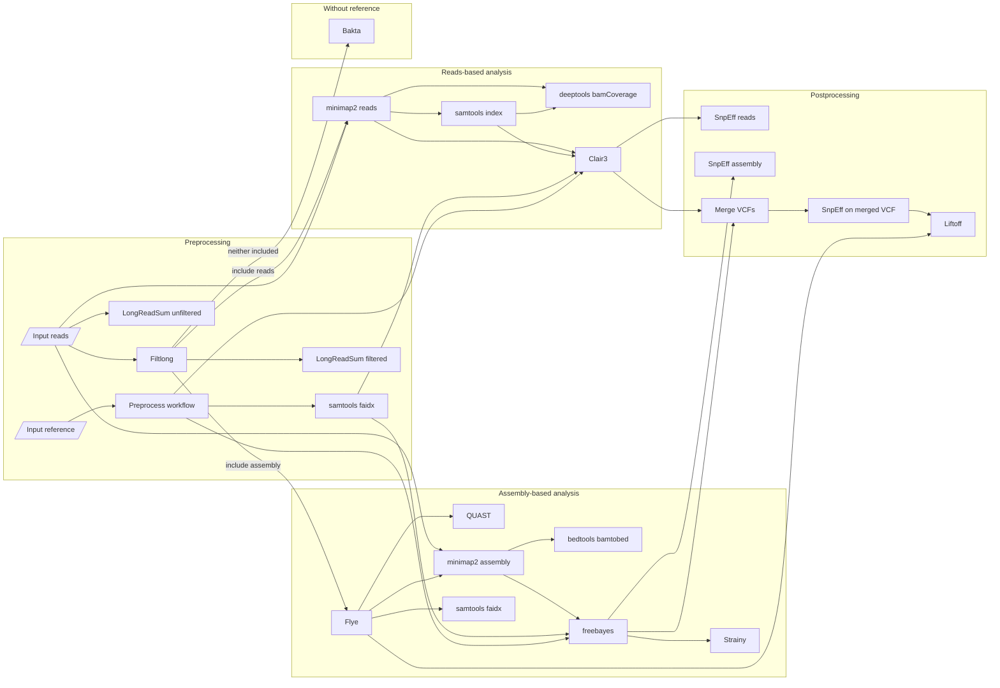

```mermaid
graph LR;

    %% Preprocessing
    subgraph Preprocessing
        AA1[/Input reads/]
        AB1[/Input reference/]
        AB1 --> A1[Preprocess workflow]
        A1 --> B1[samtools faidx]
        AA1 --> C1[LongReadSum unfiltered]
        AA1 --> D1[Filtlong]
        D1 --> E1[LongReadSum filtered]
    end

    %% Reads branch
    subgraph Reads-based analysis
        D1 --> |include reads| F1[minimap2 reads]
        F1 --> U1
        F1 --> H1
        AA1 --> F1
        F1 --> G1[samtools index]
        G1 --> U1[deeptools bamCoverage]
        G1 --> H1[Clair3]
        B1 --> H1
        A1 --> H1
    end

    %% Assembly branch
    subgraph Assembly-based analysis
        D1 --> |include assembly| J1[Flye]
        J1 --> K1[QUAST]
        AA1 --> L1
        J1 --> L1[minimap2 assembly]
        L1 --> V1[bedtools bamtobed]
        J1 --> M1[samtools faidx]
        L1 --> N1[freebayes]
        B1 --> N1
        A1 --> N1
        N1 --> O1[Strainy]
    end

    %% Postprocessing
    subgraph Postprocessing
        H1 --> I1[SnpEff reads]
        N1 --> P1[SnpEff assembly]
        H1 --> Q1[Merge VCFs]
        N1 --> Q1
        Q1 --> R1[SnpEff on merged VCF]
        R1 --> S1[Liftoff]
        J1 --> S1
    end

    %% No reference
    subgraph Without reference
        D1 --> |neither included| T1[Bakta]
    end
```