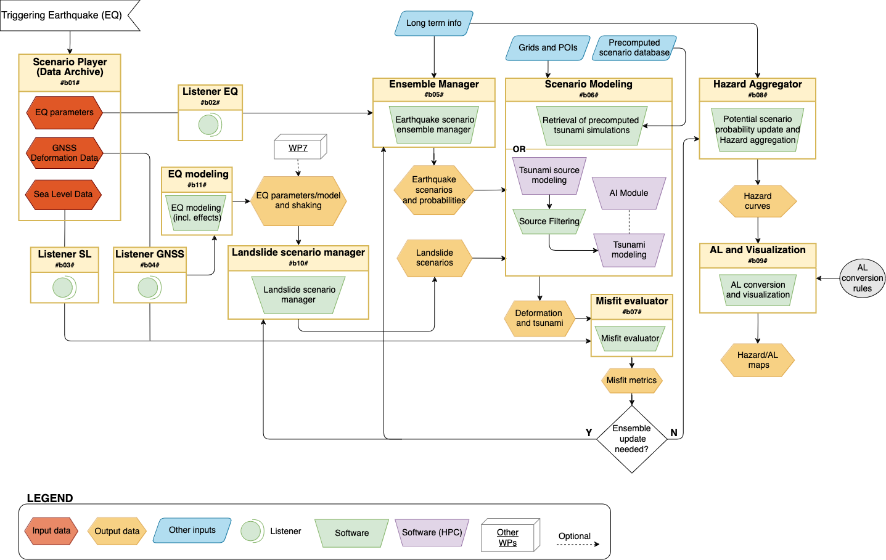
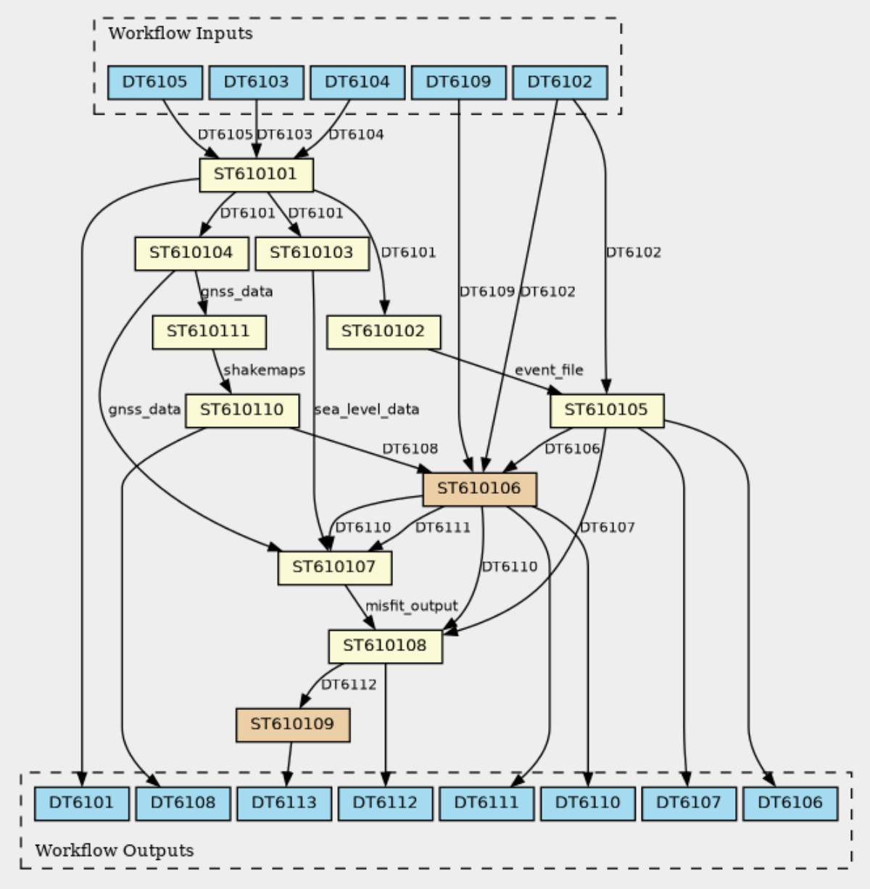
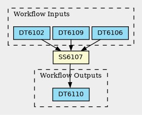

# DT-GEO DTC61 WF6101

This repository contains a Common Workflow Language (CWL) and Ro-Crate metadata definition for DTC-T1 workflow 6101, which is designed for 
providing tsunami impact forecasting following a tsunamigenic earthquake event, based on a probabilistic approach. The workflow integrates real-time
earthquake data, runs HPC simulations, and generates tsunami hazard maps. 

The main CWL implementation is found in WF6101.cwl, together with ST610106 and ST610109 describing complex steps. The file mini-ST610106.cwl is refereed to a specific
realization of the ST610106, where different alternative options are included.

To see a preview of the RO-Crate metadata the `ro-crate-preview.html` file can be opeens in the browser.

## Overview

The DTC-T1 Digital Twin component operates a single workflow (WF6101) that runs 11 main steps. DTC-T1 is also referred to as PTF,
Probabilistic Tsunami Forecasting. 

The workflow is initialized by a potentially tsunamigenic earthquake event. Based on the real-time event parameters together with long-term information 
retrieved from a regional-scale tsunami hazard model, an ensemble of earthquake scenarios compatible with the occurring event is built, where each scenario
is weighted by the probability of being a good representation of the actual event. The tsunami impact computed by numerical modeling and the scenario 
probabilities are aggregated into exceedance probabilities for given tsunami intensities at given coastal points to calculate the hazard curves and
subsequently the hazard maps. 

The workflow is designed to operate in (near-)real-time and to be employed at Tsunami Warning Centres for operational tsunami early warning and forecasting,
as well as for rapid post-event assessment.

## Workflow structure

The workflow consists of multiple steps (ST), datasets (DT), and software services (SS). Below is a simplified breakdown:

- The Scenario Player (ST610101) acts like a data archive, storing observations (synthetic or measured) (DT6101) recorded by external data providers
(i.e. seismic data, labeled as DT6103, sea level data, labeled as DT6104, and GNSS data, labeled as DT6105) and sending them to specific data listeners.

- The Listener EQ (ST610102) evaluates the earthquake information that initialise the workflow execution, while Listeners SL (ST610103) and GNSS (ST610104)
elaborate observational sea level and ground deformation data for further comparison with simulated data. 

- The Ensemble Manager (ST610105) combines the information from the Listener EQ with the long-term information from a regional hazard model (DT6102) and 
defines a list of scenarios (DT6106) compatible with the triggering event, with their associated probabilities (DT6107). 

- The ensemble of earthquake scenarios is provided as input to the Scenario Modelling (ST610106), which makes use of pre-defined topo-bathymetric grids (DT6109) 
and computes tsunami intensities (DT6110) and ground deformation (DT6111). In the modeling step different alternative and/or combined models can be used 
in each single workflow realization. More specifically, different source and tsunami models can be combined through the following software: 
Tsunami-HySEA (SS6107), SeisSol (SS6106), BingClaw (SS6109), Shaltop (SS6110), Landslide-HySEA (SS6108), Source-to-wave filter (SS6112), 
and the Inundation AI module (SS6111). User settings will dictate which model combinations are invoked. As an alternative, precomputed scenarios 
can be simply retrieved (SS6119). 

- The Misfit Evaluator (ST610107) combines simulation outputs with eventual SL and GNSS data to evaluate the degree of confidence between the simulated 
scenarios and observations. According to the computed misfit, the initial scenario ensemble and related probabilities can be updated. 

- The Hazard Aggregator (ST610108) aggregates scenario probabilities and impact metrics to calculate hazard curves at multiple forecast points (DT6112).

-  The AL (Alert level) and Visualization step (ST610109) makes the final processing of the results, converting hazard into Alert Levels and producing 
probabilistic visual maps (DT6113). It is worth noting that only the Tsunami Service Providers (TSP) are allowed in producing and issuing the AL for 
operational tsunami early warning and forecasting.

- In case of landslide-triggered tsunamis, input in the form of shake maps generated for the occurring event through the Earthquake Modeling 
(ST610111) is forwarded to the Landslide Scenario Manager (ST610110), which in turn feeds landslide scenarios (DT6108) to the Scenario Modelling.

## Workflow diagram

Here is a visual overview of the described workflow, and the corresponding CWL graph automatically generated from the metadata information stored in the 
CWL workflow file.

## The mini-ST610106 for operationalization

We focused on one realization of the Scenario Modeling step (hereinafter called mini-ST610106), where the T-HySEA code (SS6107) is used
to model both the earthquake source and the following tsunami, and only tsunami intensities (DT6110) are saved. In this experiment, the singularity 
image of the T-HySEA code created with the eFlows4HPC image service creation is used. Moreover, PyCOMPSs functionalities have been implemented in 
order to execute the mini-ST610106 as a COMPSs job on the Booster partition of the Leonardo cluster at the HPC CINECA infrastructure.

To enable execution, an executable CWL file containing only the information required to run the process has been produced. In this case, 
the processing step is implemented by the bash script `run_gpu_compss.sh` that uses PyCOMPSs to submit a job to the Leonardo cluster queue through 
the Slurm scheduler. The executable CWL file does not explicitly specify input and output data because the underlying processing step manages 
these details internally. An input configuration file `input.yaml` provides the necessary global input data.

### How to execute the mini-ST610106

The mini-workflow depicted is executed using the following command:

`cwltool --cachedir cache --preserve-entire-environment mini-ST610106.cwl input.yaml`

In this command, the --cachedir flag is employed to save all files generated during execution for debugging purposes, while the 
--preserve-entire-environment flag ensures that the current environment variables are transferred into the custom execution environment 
established by cwltool. Once the command is launched, cwltool creates an isolated execution environment where it runs the bash script, which, in turn, 
submits the PyCOMPSs job to the computational node via Slurm, with the standard output and error captured in the cwl.out and cwl.err files, respectively.

