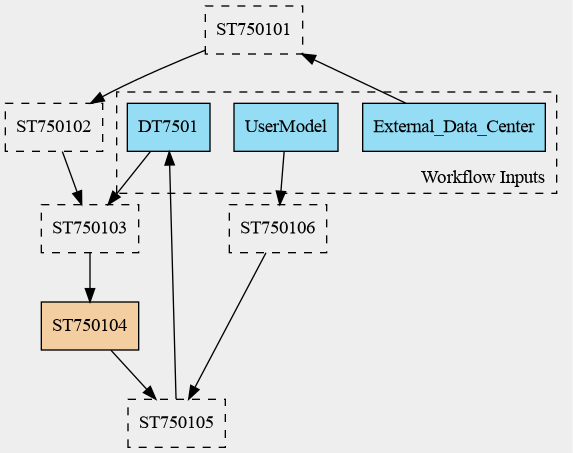

# DTC-E5 Workflow 7501 Readme
Author: Johannes Kemper

This directory contains workflow files describing the **Earth-DT** component of the Digital Twin Component for Earthquake 5 (**DTC-E5**).

## File Overview

- **WF7501.cwl**  
  This is the main entry point of the workflow. It defines the global inputs, outputs, and the connections between workflow steps. A corresponding DOT file (**WF7501.dot**) is also available for visualization.  
  **Action:** Review and complete any missing information.

- **ro-crate-metadata.json**  
  A metadata template generated from the CWL description. It should list all the entities in the workflow.  
  **Action:** Manually compile any missing details. If the CWL files are incorrect, update this file to reflect the changes.

- **workflow.png**
  Diagramatic representation of the workflow.
## Workflow Description

The **WF7501** workflow models an inversion-based update process for **CSEM (Computational Seismic Earth Model)**. Below are the key steps in this workflow:

1. **ST750101 - Data Catalog Update**  
   Collects external data sources and updates the database for further processing.

2. **ST750102 - Inversion Setup**  
   Configures inversion parameters at **local, regional, and global** levels.

3. **ST750103 - Model Extraction**  
   Extracts an initial computational model from the setup parameters.

4. **ST750104 - Inversion Iterations**  
   Performs multiple iterations to refine the extracted model.

5. **ST750105 - Model Update**  
   Updates the **CSEM model** using the results from the inversion process.

6. **ST750106 - User Model Validation**  
   The refined model undergoes external validation to ensure accuracy and usability.

## Workflow diagram

