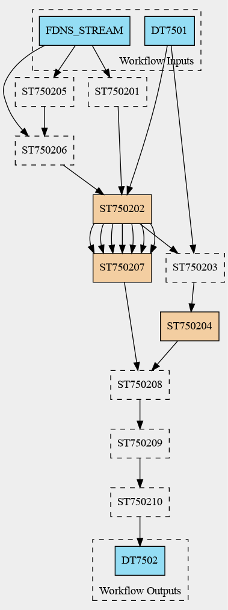

# DTC-E5 WF7502 Event-DT Workflow (Work-in-Progress)
Authors: Georgina Diez Ventura, Cedric Bhihe, Johannes Kemper

## Overview
This repository contains a **Common Workflow Language (CWL)** and **Ro-Crate** metadata definition for **DTC-E5** workflow 7502, which is designed for producing **synthetic shaking simulations** represented in code by [UCIS4EQ](https://github.com/eflows4hpc/ucis4eq). The workflow integrates **real-time earthquake data**, runs **HPC simulations**, and generates **synthetic shake maps**. The main CWL implementation is found in *WF7502.cwl*, but the MLESMap step is defined in *ST750207.cwl* as it is more complex in itself.

This is a **work-in-progress** and subject to further improvements as part of the **DT-GEO** initiative.

## Workflow Structure
The workflow consists of multiple steps (`ST`), datasets (`DT`), and software services (`SS`). Below is a simplified breakdown:

1. **Data Ingestion & Preprocessing**
   - **ST750201:** Assimilates real-time earthquake data from external sources.
   - **ST750202:** Extracts earthquake source parameters.
   - **SS7502 - SS7504:** Software services supporting data extraction.

2. **HPC Simulations & Hazard Mapping**
   - **ST750203:** Prepares input parameters for simulations.
   - **ST750204:** Runs high-performance computing (HPC) earthquake simulations.
   - **SS7501:** Simulating software salvus by mondaic.com.
   - **ST750207:** Generates synthetic shaking maps based on ML (**MLESmap**).

3. **Dynamic Updates & Urgent Computing**
   - **ST750205:** Evaluates real-time event updates.
   - **ST750206:** Enables urgent computing for time-sensitive simulations.

4. **Post-Processing & Output Storage**
   - **ST750208:** Post-processes the results.
   - **ST750209:** Gathers final outputs.
   - **ST750210:** Updates the **Shake Maps Library (DT7502)**.

## Current Status
✅ **Implemented Features**

**Global workflow**
- Step definitions and data exchange defined.
- Basic data flow between components.
- Optional execution of MLESMap ST750207 and including it as external cwl file.
- Metadata description in ro-crate-metadata.json file is complete and follows *workflow-ro-crate-1.0* profile.

**MLESMAP ST750207**
- cwl description with ability to execute

🔧 **Work-in-Progress**

**Global workflow**
- Optimization for parallel, non-linear execution (e.g., **HPC Simulations & MLESmap** running concurrently).

## Workflow diagram


### Commands
To validate the ro-crate implementation:

```bash
rocrate-validator validate .
```

To generate the workflow image:

```bash
cwltool --print-dot WF7502.cwl | dot -Tpng -o workflow.png
```
