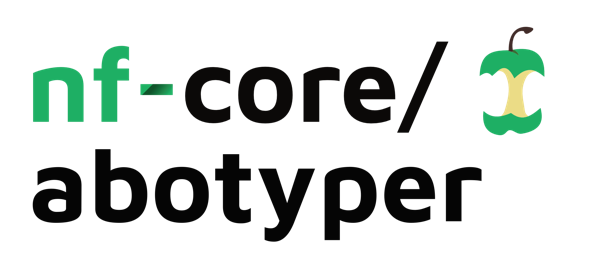
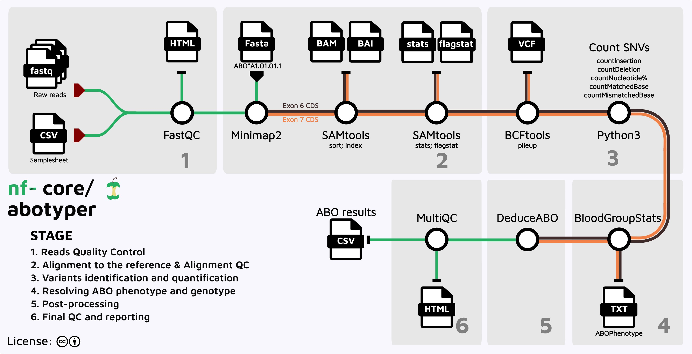

<h1>
  <picture>
    <source media="(prefers-color-scheme: light)" srcset="docs/images/nf-core-abotyper_logo_dark.png">
    
  </picture>
</h1>

[](https://github.com/nf-core/abotyper/actions/workflows/ci.yml)
[](https://github.com/nf-core/abotyper/actions/workflows/linting.yml)

[](https://nf-co.re/abotyper/results)
[](https://www.nf-test.com)

<!-- [](https://doi.org/XXXXXX) -->

[](https://www.nf-test.com)

[](https://www.nextflow.io/)
[](https://github.com/nf-core/tools/releases/tag/3.3.2)
[](https://docs.conda.io/en/latest/)
[](https://www.docker.com/)
[](https://sylabs.io/docs/)
[](https://cloud.seqera.io/launch?pipeline=https://github.com/nf-core/abotyper)

[](https://nfcore.slack.com/channels/abotyper)[](https://bsky.app/profile/nf-co.re)[](https://mstdn.science/@nf_core)[](https://www.youtube.com/c/nf-core)

# ABO blood typing using Oxford Nanopore MinION sequencing

nf-core/abotyper is a bioinformatics pipeline that analyses data obtained from Third Generation Sequencing of the `Homo sapiens ABO, alpha 1-3-N-acetylgalactosaminyltransferase and alpha 1-3-galactosyltransferase` (ABO) gene to deduce the ABO blood type.<br/>
It takes a samplesheet and FASTQ files as input, performs quality control (QC), mapping to the reference sequences, variant characterisation, and finally deduce the Blood Group Statistics based on known ABO-related Single nucleotide variants (SVNs).



ABO sequences were acquired from the NCBI RefSeq and dbRBC databases:

- [ABO Exon 6](https://www.ncbi.nlm.nih.gov/nuccore/NG_006669.2?from=22673&to=22807&report=fasta)
- [ABO Exon 7](https://www.ncbi.nlm.nih.gov/nuccore/NG_006669.2?from=23860&to=29951&report=fasta)
- [dbMHC and IHWG data](https://ftp.ncbi.nlm.nih.gov/pub/mhc/mhc/Final%20Archive/)

## Pipeline steps

The pipeline performs the following analysis steps:

1. **Reference indexing** - Convert FASTA index files (FAI) to BED format for ABO exon 6 and 7 regions ([`MAKEINDEX`](modules/local/makeindex/))
2. **Read quality control** - Quality assessment of input FASTQ files using FastQC ([`FASTQC`](modules/nf-core/fastqc/))
3. **Read alignment** - Align reads to ABO exon reference sequences using Minimap2 with metadata-driven exon mapping ([`MINIMAP2_ALIGN`](modules/nf-core/minimap2/align/))
4. **Alignment statistics** - Generate comprehensive alignment metrics including coverage, flagstat, and detailed statistics:
   - Coverage analysis ([`SAMTOOLS_COVERAGE`](modules/nf-core/samtools/coverage/))
   - Flagstat metrics ([`SAMTOOLS_FLAGSTAT`](modules/nf-core/samtools/flagstat/))
   - Detailed statistics ([`SAMTOOLS_STATS`](modules/nf-core/samtools/stats/))
5. **Variant calling** - Generate pileup files for variant detection at polymorphic positions ([`SAMTOOLS_MPILEUP`](modules/nf-core/samtools/mpileup/))
6. **Nucleotide frequency analysis** - Calculate nucleotide frequencies at ABO-relevant polymorphic positions ([`MPILEUP_NUCL_FREQ`](modules/local/mpileupstats/))
7. **SNP extraction** - Extract and analyze ABO-relevant single nucleotide variants from frequency data ([`GETABOSNPS`](modules/local/abo/abosnps/))
8. **Phenotype prediction** - Predict ABO blood group phenotype from combined SNP patterns across exons ([`ABOSNPS2PHENO`](modules/local/abo/snps2pheno/))
9. **Quality control reporting** - Compile comprehensive QC report with alignment and variant metrics ([`MULTIQC`](modules/nf-core/multiqc/))

Exon 7 CDS reference sequence was truncated at 817 bp as this captures the targeted SNVs within the exon and UTR's

## Summary of tools and version used in the pipeline

The pipeline makes use of the following core dependencies:

| Dependency             | Current version |
| ---------------------- | --------------- |
| **Core Tools**         |                 |
| fastqc                 | 0.12.1          |
| minimap2               | 2.29-r1283      |
| samtools               | 1.21            |
| multiqc                | 1.30            |
| **Python Environment** |                 |
| python                 | 3.13.5          |
| pandas                 | 2.3.1           |
| numpy                  | 2.3.2           |
| xlsxwriter             | 3.2.5           |
| json5                  | 0.12.0          |
| openpyxl               | 3.1.2           |
| re                     | 2.2.1           |

## Required input files structure

Ensure that all input fastq files have a naming convention that matches this regular expression (`regex`)

```python
## python regex for matching samples
pattern = r"^(IMM|INGS|NGS|[A-Z0-9]+)(-[0-9]+-[0-9]+)?_barcode\d+$"
```

The regex does the following:

- `^(IMM|INGS|NGS|[A-Z0-9]+)` allows for files strating with the prefixes IMM, INGS, NGS, or any combination of letters `A-to-Z` and digits `0-to-9`.
- `(-[0-9]+-[0-9]+)?` handles optional segments of digits separated by a dash(-).
- `_barcode\d+$` ensures the filename ends with_barcode followed by digits to denote barcode numbers.

There is a file handling logic in the code `filename.split("_")` that assumes the barcode is always the last part of the filename.
The names are split into `basename` and `barcode` which are then used in later reporting.<br/>Please Adjust this if necessary based on actual filename structure in your assays.

Here are a few examples of acceptable input file names:

```txt
NGSPOS_barcode13.fastq
NGSNEG_barcode12.fastq
INGSPOS_barcode01.fastq
INGSNEG_barcode96.fastq
BTGSPOS_barcode19.fastq
2025705_barcode14.fastq
IMM-45-44874_barcode25.fastq
Sample1-2024-12345_barcode22.fastq
```

## Sequencing platform compatibility

This pipeline was originally developed to process amplicon sequencing data from Oxford Nanopore Technologies platforms where multiple samples are expected to be barcoded. The pipeline has been extensively validated using Oxford Nanopore MinION data targeting ABO exons 6 and 7, which are the primary regions containing clinically relevant polymorphisms for ABO blood group determination.

While we recommend using the above naming convention for optimal compatibility, the pipeline can also handle FASTQ files from other sequencing platforms including:

- **PacBio** (currently undergoing testing)
- **Ion Torrent** (currently undergoing testing)
- **Illumina** (currently undergoing testing)

The pipeline will attempt to extract the sample name and barcode from the filenames using standard genomic sequence naming conventions, but will fall back to a default barcode00 if filenames lack the expected barcode format. For non-Nanopore platforms, ensure your FASTQ files contain reads spanning the ABO exon 6 and exon 7 regions for accurate genotyping.

## Running `nf-core/abotyper`

This pipeline has been extensively tested using conda, docker, and singularity profiles. Other containerisation methods are being improved,tested and documented.

To run this pipeline, use:

```bash
nextflow run nf-core/abotyper \
  -resume \
  -profile "<conda/docker/singularity>" \
  --input samplesheet.csv \
  --outdir "$PWD/OUTDIR"
```

Once improved, other workload managers and containerisation environments could be used in a similar manner:

```bash
nextflow nf-core/abotyper \
  -resume \
  -profile <docker/singularity/.../institute> \
  --input samplesheet.csv \
  --outdir <OUTDIR>
```

## Renaming samples

The code by permits renaming of samples using a tab-delimited file with `sequencingID` and `sampleName` (see `nextflow.config` file under `$params.renaming_file`).
This option is controlled by the parameter `$params.skip_renaming` and can be overridden via the commandline using option `--skip_renaming true` to skip the process.

## Output

For each sample and each of exon6 and exon7, the pipeline will generate `BAM` files, `BAM metrics`, and `PILEUP` results.

The output directory generated by this `Nextflow` pipeline will look something like this:

```
OUTDIR/
├── ABO_results.log
├── ABO_result.txt
├── ABO_result.xlsx
├── final_export.csv
├── per_sample_processing
│   ├── SAMPLE1_barcode01
│   │   ├── exon6
│   │   │   ├── ABOReadPolymorphisms.txt
│   │   │   ├── alignment
│   │   │   │   ├── SAMPLE1_barcode01.bam
│   │   │   │   ├── SAMPLE1_barcode01.bam.bai
│   │   │   │   ├── SAMPLE1_barcode01.coverage.txt
│   │   │   │   ├── SAMPLE1_barcode01.flagstat
│   │   │   │   └── SAMPLE1_barcode01.stats
│   │   │   ├── SAMPLE1_barcode01.ABOPhenotype.txt
│   │   │   ├── SAMPLE1_barcode01.AlignmentStatistics.tsv
│   │   │   ├── SAMPLE1_barcode01.log.txt
│   │   │   └── mpileup
│   │   │       └── SAMPLE1_barcode01.mpileup.gz
│   │   └── exon7
│   │       ├── ABOReadPolymorphisms.txt
│   │       ├── alignment
│   │       │   ├── SAMPLE1_barcode01.bam
│   │       │   ├── SAMPLE1_barcode01.bam.bai
│   │       │   ├── SAMPLE1_barcode01.coverage.txt
│   │       │   ├── SAMPLE1_barcode01.flagstat
│   │       │   └── SAMPLE1_barcode01.stats
│   │       ├── SAMPLE1_barcode01.ABOPhenotype.txt
│   │       ├── SAMPLE1_barcode01.AlignmentStatistics.tsv
│   │       ├── SAMPLE1_barcode01.log.txt
│   │       └── mpileup
│   │           └── SAMPLE1_barcode01.mpileup.gz
├── pipeline_info
│   ├── execution_report_DATETIME.html
│   ├── execution_timeline_DATETIME.html
│   ├── execution_trace_DATETIME.txt
│   ├── nf_core_pipeline_software_mqc_versions.yml
│   ├── params_DATETIME.json
│   └── pipeline_dag_DATETIME.html
└── qc-reports
    ├── fastqc
    │   ├── SAMPLE1_barcode01_fastqc.html
    │   ├── SAMPLE1_barcode01_fastqc.zip
    └multiqc
        ├── multiqc_data
        ├── multiqc_plots
        │   ├── pdf
        │   ├── png
        │   └── svg
        └── multiqc_report.html
```

The `ABO_result.xlsx` Excel worksheet contains details of all SNVs and metrics used to deduce the ABO phenotype for each sample.

A summary of the ABO typing results is provided in `final_export.csv`

Feel free to raise an issue or reach out if you need any support getting this tool running, or with suggestions for improvement.

## Credits

nf-core/abotyper was originally written by Fredrick M. Mobegi: [@fmobegi](https://github.com/fmobegi) at the Department of Clinical Immunology, [PathWest Laboratory Medicine WA](https://pathwest.health.wa.gov.au/).

We thank the following people for their extensive assistance in the development and testing of this pipeline:

- [Benedict Matern](https://github.com/bmatern)
- [Mathijs Groeneweg](https://orcid.org/0000-0002-6615-9239)
- [Filipe Ayora](https://github.com/fayora)

Maintenance and future developements will be led by Fredrick Mobegi.

## Acknowledgements

<p float="center">
  
  
</p>

## Contributions and Support

If you would like to contribute to this pipeline, please see the [contributing guidelines](.github/CONTRIBUTING.md).

For further information or help, don't hesitate to get in touch on the [Slack `#abotyper` channel](https://nfcore.slack.com/channels/abotyper) (you can join with [this invite](https://nf-co.re/join/slack)).

## Further reading

Results generated from this pipeline should be interpreted together with the corresponding publication and literature on ABO genotyping.

To get up to speed with ABO genotyping, there is detailed reading material [here](https://ftp.ncbi.nlm.nih.gov/pub/mhc/rbc/Final%20Archive/Excel_and_PowerPoint/).

Verified SNVs relevant to ABO blood group genotyping have also been documented extensively [here](https://bloodgroupdatabase.org/groups/details/?group_name=ABO)

## Citations

If you use nf-core/abotyper for your analysis, please cite it using the following publication:

> **Characterisation of the ABO Blood Group Phenotypes Using Third-Generation Sequencing.**
>
> Fredrick M. Mobegi, Samuel Bruce, Naser El-Lagta, Felipe Ayora, Benedict M. Matern, Mathijs Groeneweg, Lloyd J. D'Orsogna & Dianne De Santis.
>
> _Int. J. Mol. Sci._ 2025 Jun 06. doi: [10.3390/ijms26125443](https://doi.org/10.3390/ijms26125443).

An extensive list of references for the tools used by the pipeline can be found in the [`CITATIONS.md`](CITATIONS.md) file.

You can cite the `nf-core` publication as follows:

> **The nf-core framework for community-curated bioinformatics pipelines.**
>
> Philip Ewels, Alexander Peltzer, Sven Fillinger, Harshil Patel, Johannes Alneberg, Andreas Wilm, Maxime Ulysse Garcia, Paolo Di Tommaso & Sven Nahnsen.
>
> _Nat Biotechnol._ 2020 Feb 13. doi: [10.1038/s41587-020-0439-x](https://dx.doi.org/10.1038/s41587-020-0439-x).
>
> _Int. J. Mol. Sci._ 2025 Jun 06. doi: [10.3390/ijms26125443](https://doi.org/10.3390/ijms26125443).

An extensive list of references for the tools used by the pipeline can be found in the [`CITATIONS.md`](CITATIONS.md) file.

You can cite the `nf-core` publication as follows:

> **The nf-core framework for community-curated bioinformatics pipelines.**
>
> Philip Ewels, Alexander Peltzer, Sven Fillinger, Harshil Patel, Johannes Alneberg, Andreas Wilm, Maxime Ulysse Garcia, Paolo Di Tommaso & Sven Nahnsen.
>
> _Nat Biotechnol._ 2020 Feb 13. doi: [10.1038/s41587-020-0439-x](https://dx.doi.org/10.1038/s41587-020-0439-x).
