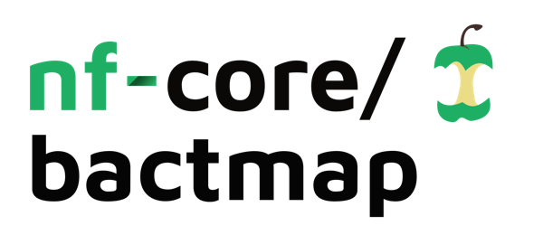

<h1>
  <picture>
    <source media="(prefers-color-scheme: dark)" srcset="docs/images/nf-core-bactmap_logo_dark.png">
    
  </picture>
</h1>

[](https://github.com/nf-core/bactmap/actions/workflows/ci.yml)
[](https://github.com/nf-core/bactmap/actions/workflows/linting.yml)[](https://nf-co.re/bactmap/results)[](https://doi.org/10.5281/zenodo.XXXXXXX)
[](https://www.nf-test.com)

[](https://www.nextflow.io/)
[](https://docs.conda.io/en/latest/)
[](https://www.docker.com/)
[](https://sylabs.io/docs/)
[](https://cloud.seqera.io/launch?pipeline=https://github.com/nf-core/bactmap)

[](https://nfcore.slack.com/channels/bactmap)[](https://twitter.com/nf_core)[](https://mstdn.science/@nf_core)[](https://www.youtube.com/c/nf-core)

## Introduction

**nf-core/bactmap** is a bioinformatics best-practice analysis pipeline for mapping short (Illumina) and long reads (Oxford Nanopore) from bacterial WGS to a reference sequence, creating filtered VCF files and making pseudogenomes based on high quality positions in the VCF files.

## Pipeline summary


1. Index reference fasta file (short-read: [`BWA index`](https://github.com/lh3/bwa) or [`Bowtie2 build`](http://bowtie-bio.sourceforge.net/bowtie2/index.shtml); long-read: [`minimap2 index`](https://github.com/lh3/minimap2))
2. Read QC ([`FastQC`](https://www.bioinformatics.babraham.ac.uk/projects/fastqc/) or [`falco`](https://github.com/smithlabcode/falco) as an alternative option)
3. Calculate fastq summary statistics ([`fastq-scan`](https://github.com/rpetit3/fastq-scan))
4. Perform read pre-processing (optional)
   - Adapter clipping and merging (short-read: [`fastp`](https://github.com/OpenGene/fastp) or [`AdapterRemoval2`](https://github.com/MikkelSchubert/adapterremoval); long-read: [`porechop`](https://github.com/rrwick/Porechop) or [`Porechop_ABI`](https://github.com/bonsai-team/Porechop_ABI))
   - Quality filtering (long-read: [`Filtlong`](https://github.com/rrwick/Filtlong)), [`Nanoq`](https://github.com/esteinig/nanoq)
   - Run merging ([`cat`](https://pubs.opengroup.org/onlinepubs/9699919799/utilities/cat.html))
5. Downsample fastq files (optional) ([`Rasusa`](https://github.com/mbhall88/rasusa))
6. Summarise read statistics pre- and post-processing and subsampling ([`read_stats`](https://github.com/nf-core/bactmap/blob/master/modules/local/read_stats/main.nf))
7. Variant calling

- Map reads to reference (short-read: [`BWA-MEM2`](https://github.com/bwa-mem2/bwa-mem2) or [`Bowtie2`](http://bowtie-bio.sourceforge.net/bowtie2/index.shtml); long-read: [`minimap2`](https://github.com/lh3/minimap2))
- Sort and index alignments ([`SAMtools view/sort`](https://sourceforge.net/projects/samtools/files/samtools/))
- Summarise alignment statistics ([`SAMtools stats`](https://sourceforge.net/projects/samtools/files/samtools/))
- Call variants (short-read: [`FreeBayes`](https://github.com/freebayes/freebayes); long-read: [`Clair3`](https://github.com/HKU-BAL/Clair3))
- Filter variants ([`BCFtools filter`](http://samtools.github.io/bcftools/bcftools.html))
- Summarise variant statistics ([`BCFtools stats`](http://samtools.github.io/bcftools/bcftools.html))
- Convert filtered bcf to pseudogenome fasta ([`BCFtools consensus`](http://samtools.github.io/bcftools/bcftools.html) and [`BEDtools`](https://bedtools.readthedocs.io/en/latest/content/tools/genomecov.html))
- Summarise mapping statistics ([`seqtk`](https://github.com/lh3/seqtk))

8. Create alignment from pseudogenomes by concatenating fasta files having first checked that the sample sequences are high quality ([`alignpseudogenomes`](https://github.com/nf-core/bactmap/blob/master/modules/local/alignpseudogenomes/main.nf))
9. Extract variant sites from alignment ([`SNP-sites`](https://github.com/sanger-pathogens/snp-sites))
10. Present QC for raw and processed reads, alignment statistics and variant statistics ([`MultiQC`](http://multiqc.info/))

## Usage

> [!NOTE]
> If you are new to Nextflow and nf-core, please refer to [this page](https://nf-co.re/docs/usage/installation) on how to set-up Nextflow. Make sure to [test your setup](https://nf-co.re/docs/usage/introduction#how-to-run-a-pipeline) with `-profile test` before running the workflow on actual data.

First, prepare a samplesheet with your input data that looks as follows:

```csv title="samplesheet.csv"
sample,run_accession,instrument_platform,fastq_1,fastq_2
2612,run1,ILLUMINA,2612_run1_R1.fq.gz,
2613,run1,ILLUMINA,2612_run3_R1.fq.gz,2612_run3_R2.fq.gz
2614,run3,OXFORD_NANOPORE,2614_file1.fastq.gz,
2614,run3,OXFORD_NANOPORE,2614_file2.fastq.gz,
```

Each row represents a fastq file (single-end) or a pair of fastq files (paired end), either Illumina (short reads) or Oxford Nanopore (long reads).

Additionally, if you are analysing Oxford Nanopore data, you will need to provide the path to a model to use with `Clair3` (specified with `--clair3_model`). Models for older chemistries and basecallers (e.g. r9.4.1) can be downloaded from [here](https://www.bio8.cs.hku.hk/clair3/clair3_models/). For newer chemistries and basecallers, ONT provides models through [Rerio](https://github.com/nanoporetech/rerio). To download the models for Clair3 from the ONT github, you can use the following commands (each model will be downloaded to the folder `clair3_models/<clair3_model_name>`):

```bash
# Clone the rerio repository
git clone https://github.com/nanoporetech/rerio

# Download all models
python3 download_model.py --clair3
```

Now, you can run the pipeline using:

```bash
nextflow run nf-core/bactmap \
   -profile <docker/singularity/.../institute> \
   --input samplesheet.csv \
   --fasta <REFERENCE_FASTA> \
   --clair3_model <PATH_TO_CLAIR3_MODEL> \
   --outdir <OUTDIR>
```

> [!WARNING]
> Please provide pipeline parameters via the CLI or Nextflow `-params-file` option. Custom config files including those provided by the `-c` Nextflow option can be used to provide any configuration _**except for parameters**_; see [docs](https://nf-co.re/docs/usage/getting_started/configuration#custom-configuration-files).

For more details and further functionality, please refer to the [usage documentation](https://nf-co.re/bactmap/usage) and the [parameter documentation](https://nf-co.re/bactmap/parameters).

## Pipeline output

To see the results of an example test run with a full size dataset refer to the [results](https://nf-co.re/bactmap/results) tab on the nf-core website pipeline page.
For more details about the output files and reports, please refer to the
[output documentation](https://nf-co.re/bactmap/output).

## Credits

nf-core/bactmap was originally written by [Anthony Underwood](https://github.com/antunderwood), [Andries van Tonder](https://github.com/avantonder) and [Thanh Le Viet](https://github.com/thanhleviet).

We thank the following people for their extensive assistance in the development
of this pipeline:

- [Alexandre Gilardet](https://github.com/alexandregilardet)
- [Hanh Hoang](https://github.com/sainsachiko)
- [Ismael Henarejos-Castilo](https://github.com/IsmaelHC1994)
- [Mareike Janiak](https://github.com/MareikeJaniak)
- [Harshil Patel](https://github.com/drpatelh)
- [Olha Petryk](https://github.com/opetryk)
- [Richard Agyekum](https://github.com/QuadjoLegend)
- [Steven Sutcliffe](https://github.com/sgsutcliffe)
- [Szymon Szyszkowski](https://github.com/project-defiant)

Anthony Underwood's time working on the project was funded by the National Institute for Health Research(NIHR) Global Health Research Unit for the Surveillance of Antimicrobial Resistance (Grant Reference Number 16/136/111)


## Contributions and Support

If you would like to contribute to this pipeline, please see the [contributing guidelines](.github/CONTRIBUTING.md).

For further information or help, don't hesitate to get in touch on the [Slack `#bactmap` channel](https://nfcore.slack.com/channels/bactmap) (you can join with [this invite](https://nf-co.re/join/slack)).

## Citations

<!-- TODO nf-core: Add citation for pipeline after first release. Uncomment lines below and update Zenodo doi and badge at the top of this file. -->
<!-- If you use nf-core/bactmap for your analysis, please cite it using the following doi: [10.5281/zenodo.XXXXXX](https://doi.org/10.5281/zenodo.XXXXXX) -->

An extensive list of references for the tools used by the pipeline can be found in the [`CITATIONS.md`](CITATIONS.md) file.

You can cite the `nf-core` publication as follows:

> **The nf-core framework for community-curated bioinformatics pipelines.**
>
> Philip Ewels, Alexander Peltzer, Sven Fillinger, Harshil Patel, Johannes Alneberg, Andreas Wilm, Maxime Ulysse Garcia, Paolo Di Tommaso & Sven Nahnsen.
>
> _Nat Biotechnol._ 2020 Feb 13. doi: [10.1038/s41587-020-0439-x](https://dx.doi.org/10.1038/s41587-020-0439-x).
