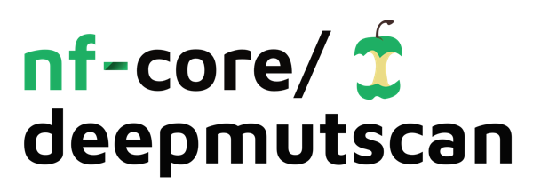
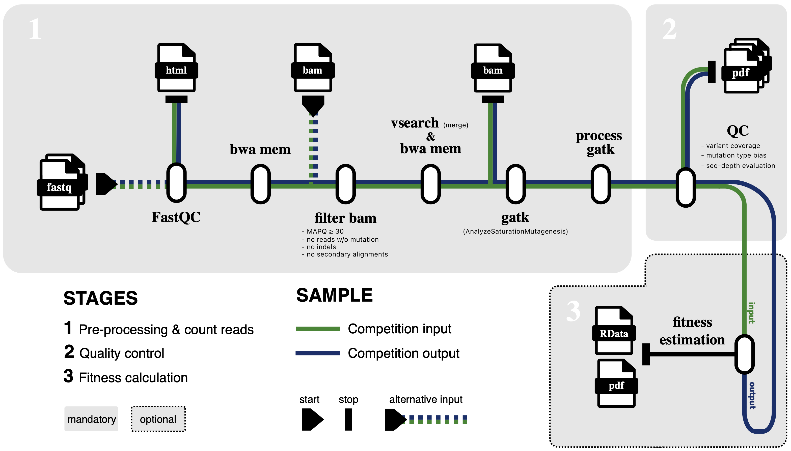

<h1>
  <picture>
    <source media="(prefers-color-scheme: dark)" srcset="docs/images/nf-core-deepmutscan_logo_dark.png">
    
  </picture>
</h1>

[](https://github.com/nf-core/deepmutscan/actions/workflows/ci.yml)
[](https://github.com/nf-core/deepmutscan/actions/workflows/linting.yml)[](https://nf-co.re/deepmutscan/results)[](https://doi.org/10.5281/zenodo.XXXXXXX)
[](https://www.nf-test.com)

[](https://www.nextflow.io/)
[](https://docs.conda.io/en/latest/)
[](https://www.docker.com/)
[](https://sylabs.io/docs/)
[](https://cloud.seqera.io/launch?pipeline=https://github.com/nf-core/deepmutscan)

[](https://nfcore.slack.com/channels/deepmutscan)[](https://twitter.com/nf_core)[](https://mstdn.science/@nf_core)[](https://www.youtube.com/c/nf-core)

## Introduction

**nf-core/deepmutscan** is a workflow designed for the analysis of deep mutational scanning (DMS) data. DMS enables researchers to experimentally measure the fitness effects of thousands of genes or gene variants simultaneously, helping to classify disease causing mutants in human and animal populations, to learn the fundamental rules of protein architecture, small-molecule binding, mRNA splicing, viral evolution and many other quantifiable phenotypes.

While DNA synthesis and sequencing technologies have advanced substantially, long open reading frame (ORF) targets still present a major challenge for DMS studies. Shotgun DNA sequencing can be used to greatly speed up the inference of long ORF mutant fitness landscapes, theoretically at no expense in accuracy. We have designed the `nf-core/deepmutscan` pipeline to unlock the power of shotgun sequencing based DMS studies on long ORFs, to simplify and standardise the complex bioinformatics steps involved in data processing of such experiments – from read alignment to QC reporting and fitness landscape inferences.



The pipeline is built using [Nextflow](https://www.nextflow.io), a workflow tool to run tasks across multiple compute infrastructures in a very portable manner. It uses Docker/Singularity containers making installation trivial and results highly reproducible. The [Nextflow DSL2](https://www.nextflow.io/docs/latest/dsl2.html) implementation of this pipeline uses one container per process which makes it much easier to maintain and update software dependencies. Where possible, these processes have been submitted to and installed from [nf-core/modules](https://github.com/nf-core/modules) in order to make them available to all nf-core pipelines, and to everyone within the Nextflow community!

On release, automated continuous integration tests run the pipeline on a full-sized dataset on the AWS cloud infrastructure. This ensures that the pipeline runs on AWS, has sensible resource allocation defaults set to run on real-world datasets, and permits the persistent storage of results to benchmark between pipeline releases and other analysis sources. The results obtained from the full-sized test can be viewed on the [nf-core website](https://nf-co.re/deepmutscan/results).

## Major features

- End-to-end analyses of various DMS data
- Modular, three-stage workflow: alignment → QC → error-aware fitness estimation
- Integration with popular statistical fitness estimation tools like [DiMSum](https://github.com/lehner-lab/DiMSum), [Enrich2](https://github.com/FowlerLab/Enrich2), [rosace](https://github.com/pimentellab/rosace/) and [mutscan](https://github.com/fmicompbio/mutscan)
- Support of multiple mutagenesis strategies, e.g. by nicking with degenerate NNK and NNS codons
- Containerisation via Docker, Singularity and Apptainer
- Scalability across HPC and Cloud systems
- Monitoring of CPU, memory, and CO₂ usage

For more details on the pipeline and on potential future expansions, please consider reading our [usage description](https://nf-co.re/deepmutscan/usage).

## Step-by-step pipeline summary

The pipeline processes deep mutational scanning (DMS) sequencing data in several stages:

1. Alignment of reads to the reference open reading frame (ORF) (`BWA-mem`)
2. Filtering of wildtype and erroneous reads (`samtools view`)
3. Read merging for base error reduction (`vsearch merge`, `BWA-mem`)
4. Mutation counting (`GATK AnalyzeSaturationMutagenesis`)
5. DMS library quality control
6. Data summarisation across samples
7. Single nucleotide variant error correction _(in development)_
8. Fitness estimation

## Usage

> [!NOTE]
> If you are new to Nextflow and nf-core, please refer to [this page](https://nf-co.re/docs/usage/installation) on how to set-up Nextflow. Make sure to [test your setup](https://nf-co.re/docs/usage/introduction#how-to-run-a-pipeline) with `-profile test` before running the workflow on actual data.

First, prepare a samplesheet with your input/output data in which each row represents a pair of fastq files (paired end). This should look as follows:

```csv title="samplesheet.csv"
sample,type,replicate,file1,file2
ORF1,input,1,/reads/forward1.fastq.gz,/reads/reverse1.fastq.gz
ORF1,input,2,/reads/forward2.fastq.gz,/reads/reverse2.fastq.gz
ORF1,output,1,/reads/forward3.fastq.gz,/reads/reverse3.fastq.gz
ORF1,output,2,/reads/forward4.fastq.gz,/reads/reverse4.fastq.gz
```

Secondly, specify the gene or gene region of interest using a reference FASTA file via `--fasta`. Provide the exact codon coordinates using `--reading_frame`.

Now, you can run the pipeline using:

```bash title="example_run.sh"
nextflow run nf-core/deepmutscan \
   -profile <docker/singularity/.../institute> \
   --input ./samplesheet.csv \
   --fasta ./ref.fa \
   --reading_frame 1-300 \
   --outdir ./results
```

## Pipeline output

To see the results of an example test run with a full size dataset refer to the [results](https://nf-co.re/deepmutscan/results) tab on the nf-core website pipeline page.

For more details about the output files and reports, please refer to the
[output documentation](https://nf-co.re/deepmutscan/output).

## Contributing

We welcome contributions from the community!

For technical challenges and feedback on the pipeline, please use our [Github repository](https://github.com/nf-core/deepmutscan). Please open an [issue](https://github.com/nf-core/deepmutscan/issues/new) or [pull request](https://github.com/nf-core/deepmutscan/compare) to:

- Report bugs or solve data incompatibilities when running `nf-core/deepmutscan`
- Suggest the implementation of new modules for custom DMS workflows
- Help improve this documentation

If you are interested in getting involved as a developer, please consider joining our interactive [`#deepmutscan` Slack channel](https://nfcore.slack.com/channels/deepmutscan) (via [this invite](https://nf-co.re/join/slack)).

## Credits

nf-core/deepmutscan was originally written by [Benjamin Wehnert](https://github.com/BenjaminWehnert1008) and [Max Stammnitz](https://github.com/MaximilianStammnitz) at the [Centre for Genomic Regulation, Barcelona](https://www.crg.eu/), with the generous support of an EMBO Long-term Postdoctoral Fellowship and a Marie Skłodowska-Curie grant by the European Union.

If you use `nf-core/deepmutscan` in your analyses, please cite:

> 📄 Wehnert et al., _bioRxiv_ preprint (coming soon)

Please also cite the `nf-core` framework:

> 📄 Ewels et al., _Nature Biotechnology_, 2020
> [https://doi.org/10.1038/s41587-020-0439-x](https://doi.org/10.1038/s41587-020-0439-x)

For further information or help, don't hesitate to get in touch on the [Slack `#deepmutscan` channel](https://nfcore.slack.com/channels/deepmutscan) (you can join with [this invite](https://nf-co.re/join/slack)).

## Scientific contact

For scientific discussions around the use of this pipeline (e.g. on experimental design or sequencing data requirements), please feel free to get in touch with us directly:

- Benjamin Wehnert — wehnertbenjamin@gmail.com
- Maximilian Stammnitz — maximilian.stammnitz@crg.eu
