# nf-core/deepmutscan: Output

## Introduction

The directories listed below will be created in the results directory after `nf-core/deepmutscan` has finished. All paths are relative to the top-level results directory:

```tree title="nf-core/deepmutscan results"
results/
├── fastqc/              # Individual raw sequencing QC reports for each specified fastq file, in `.html`
├── fitness/             # Merged variant count tables, fitness and error estimates, replicate correlations and heatmaps
├── intermediate_files/  # Raw alignments, raw and pre-filtered variant count tables, QC reports
├── library_QC/          # Sample-specific PDF visualizations: position-wise sequencing coverage, count heatmaps, etc.
├── multiqc/             # Shared raw sequencing QC report for all fastq files, in `.html`
├── pipelineinfo/        # Nextflow helper files for timeline and summary report generation
├── timeline.html        # Nextflow timeline for all tasks
└── report.html          # Nextflow summary report incl. detailed CPU and memory usage per for all tasks
```

### FastQC

[FastQC](http://www.bioinformatics.babraham.ac.uk/projects/fastqc/) gives general quality metrics about your sequenced reads. It provides information about the quality score distribution across your reads, per base sequence content (%A/T/G/C), adapter contamination and overrepresented sequences. For further reading and documentation see the [FastQC help pages](http://www.bioinformatics.babraham.ac.uk/projects/fastqc/Help/).

<details markdown="1">
<summary>Output files</summary>

- `fastqc/`
  - `*_fastqc.zip`: Zip archive containing the FastQC report, tab-delimited data file and plot images
  - `*_fastqc.html`: FastQC report containing quality metrics

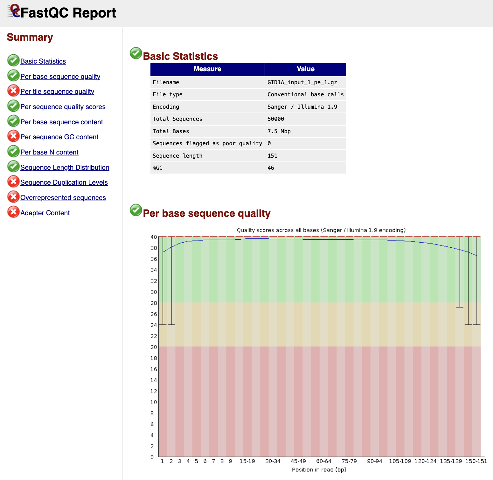

</details>

### MultiQC

[MultiQC](http://multiqc.info) is a visualization tool that generates a single HTML report summarising all samples in your project. Most of the pipeline QC results are visualised in the report and further statistics are available in the report data directory. Results generated by MultiQC collate pipeline QC from supported tools e.g. FastQC. The pipeline has special steps which also allow the software versions to be reported in the MultiQC output for future traceability. For more information about how to use MultiQC reports, see <http://multiqc.info>.### Pipeline information

<details markdown="1">
<summary>Output files</summary>

- `multiqc/`
  - `multiqc_report.html`: a standalone `.html` file that can be viewed in your web browser
  - `multiqc_data/`: directory containing parsed statistics from the different tools used in the pipeline
  - `multiqc_plots/`: directory containing static images from the report in various formats

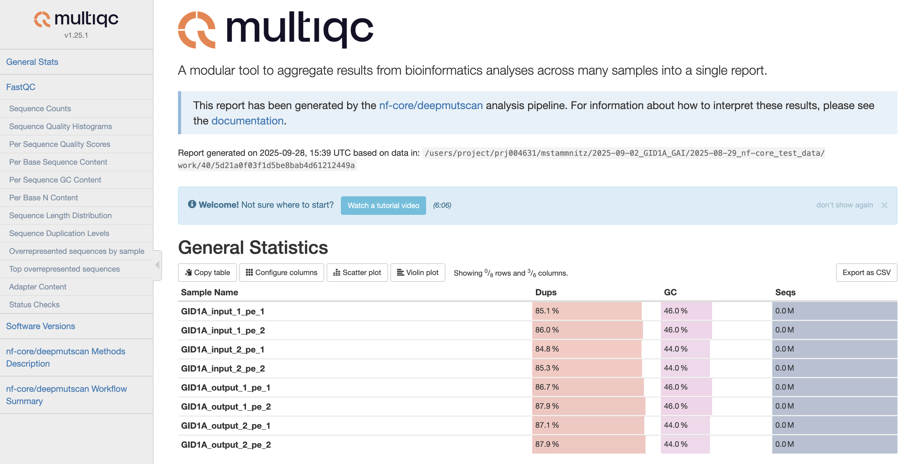
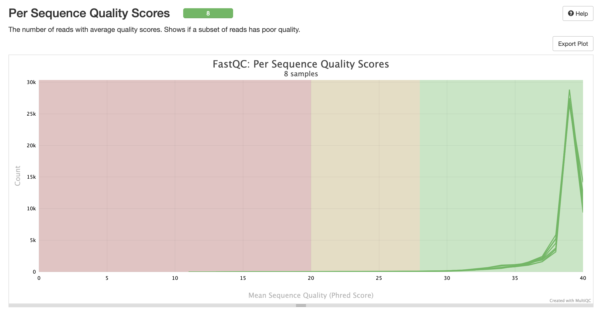
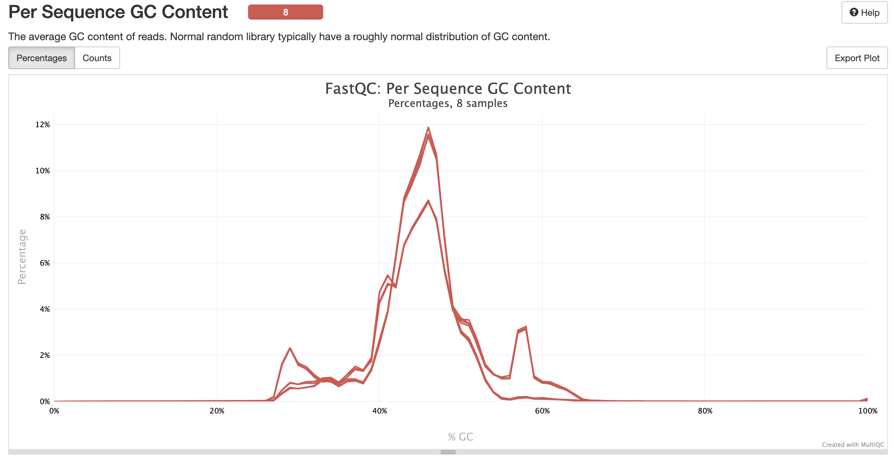

</details>

### Intermediate files (Core Pipeline Stages 1-4)

This directory is created during the first series of steps of the pipeline, featuring raw read alignments, filtering and variant counting.

<details markdown="1">
<summary>Output files</summary>

- `intermediate_files/`
  - `aa_seq.txt`: a string of the reconstructed wildtype amino acid sequence of the specified open reading frame
  - `possible_mutations.csv`: using the `--mutagenesis` argument, this file lists all the programmed mutations per position; these are used for variant count filtering and visualisation
  - `bam_files/bwa/`: sets of BWA referenes indices from the original alignment(s), with BAM files for each sample in the `mem/` subfolder
  - `bam_files/filtered/`: filtered BAM files for each sample, without any wildtype or indel-matching reads
  - `bam_files/premerged/`: filtered, read-merged and re-aligned BAM files for each sample, representing highest-quality alignments for subsequent variant counting
  - `gatk/`: subfolders with resulting variant count table outputs from `AnalyzeSaturationMutagenesis`, stratified by sample
  - `processed_gatk_files/`: subfolders with prefiltered GATK variant count tables, stratified by sample

</details>

### Library QC (Core Pipeline Stage 5)

This directory is created during the second series of steps of the pipeline, featuring various QC visualisations for each sample.

<details markdown="1">
<summary>Output files</summary>

- `library_QC/`
  - `counts_heatmap.pdf`: a complete heatmap of absolute mutant counts, stratified by mutant amino acid (Y-axis) per position (X-axis)
    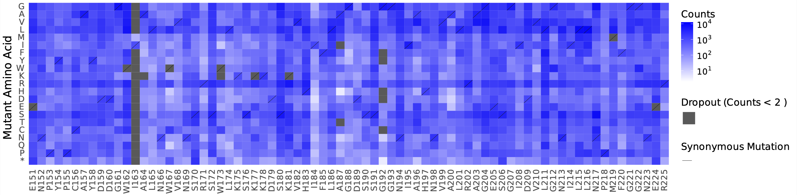

  - `counts_per_cov_heatmap.pdf`: as above, but as a fraction of the total sequencing coverage
  - `logdiff_plot.pdf`: sorted, log-scale coverage distribution of all mutants
    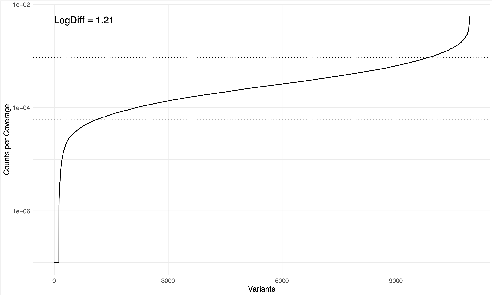

  - `logdiff_varying_bases.pdf`: as above, but stratified by hamming distance to the wildtype nucleotide sequence (colour shading)
  - `rolling_coverage.pdf`: sliding-window rolling coverage
    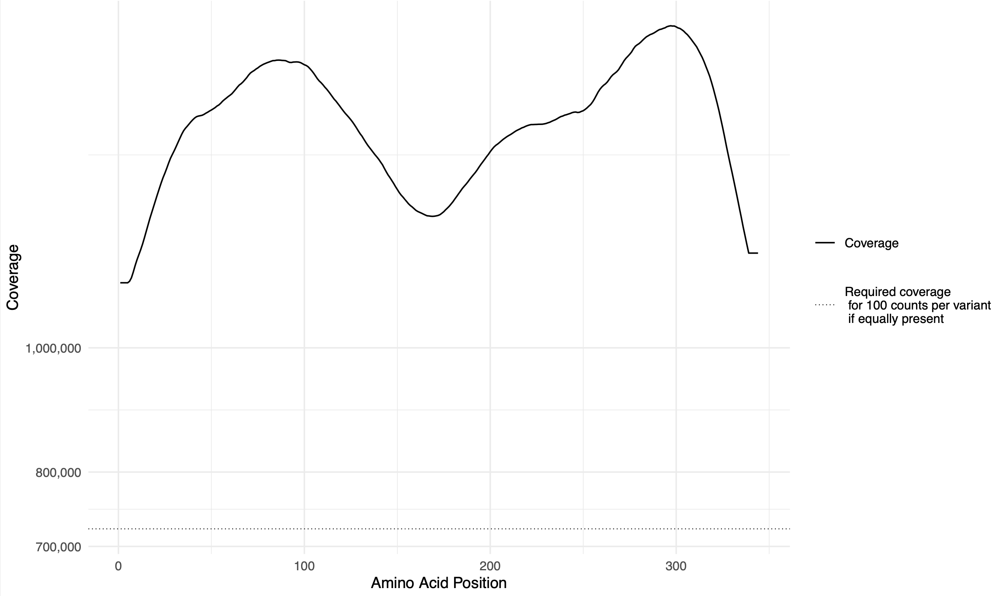

  - `rolling_counts.pdf`: sliding-window rolling coverage, stratified by hamming distance to the wildtype nucleotide sequence (colour shading)
    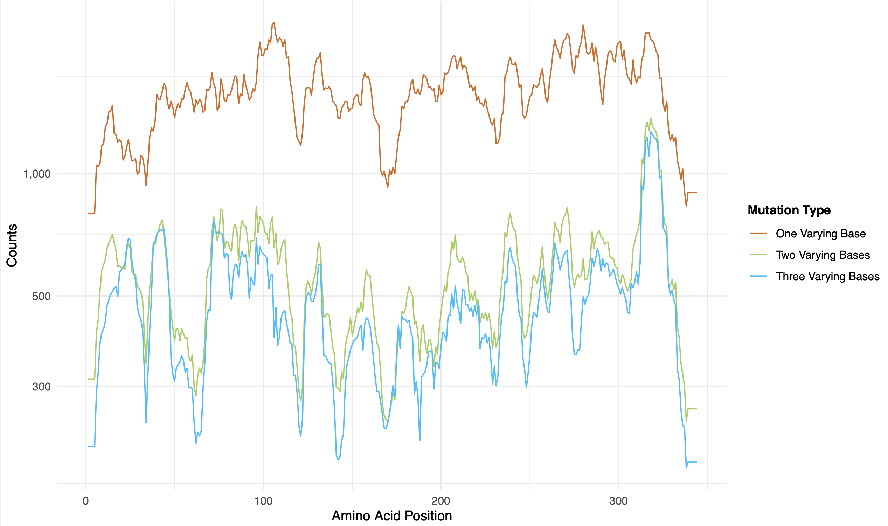

  - `rolling_counts_per_cov.pdf`: as above, but as a fraction of the total sequencing coverage
  - `SeqDepth.pdf` (optional via the `--run_seqdepth` argument): rarefaction curve of the sequencing coverage and how it relates to the percentage of programmed variants detected
    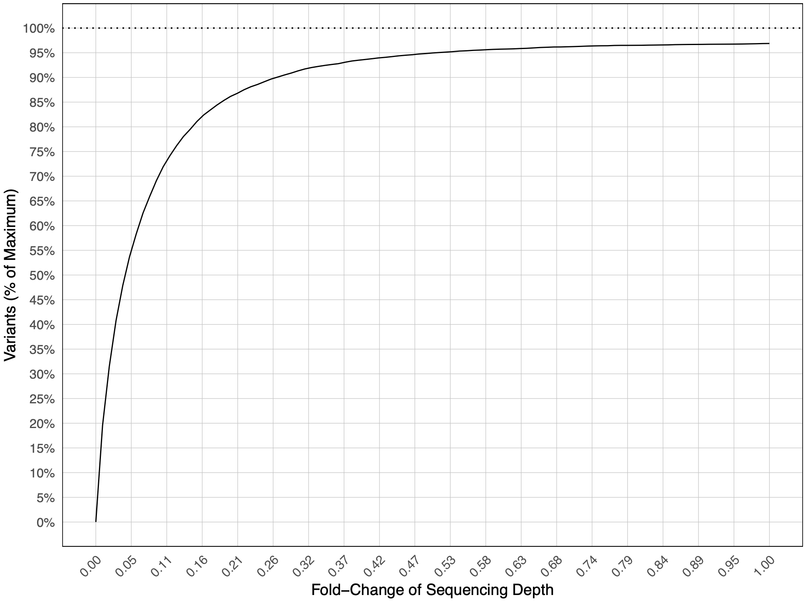

</details>

### Fitness (Core Pipeline Stages 6-8)

This directory is created during the final series of steps of the pipeline, featuring fitness and fitness error estimates (when DMS input/output sample groups are specified).

<details markdown="1">
<summary>Output files</summary>

- `fitness/`
  - `counts_merged.tsv`: summarised gene variant counts across all input and output samples
  - `default_results/fitness_estimation_count_correlation.pdf`: pair-wise replicate variant count scatterplots and correlations between all specified samples
    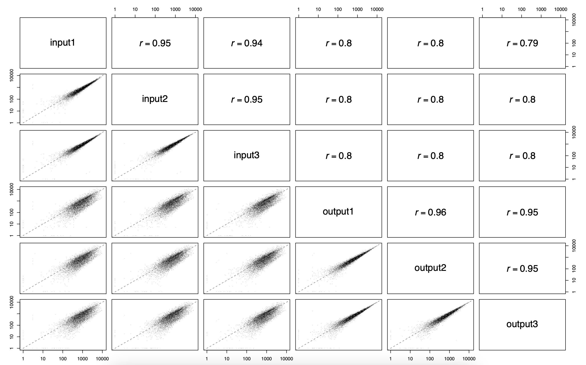

  - `default_results/fitness_estimation_fitness_correlation.pdf`: pair-wise fitness replicate scatterplots and correlations between all specified output samples
    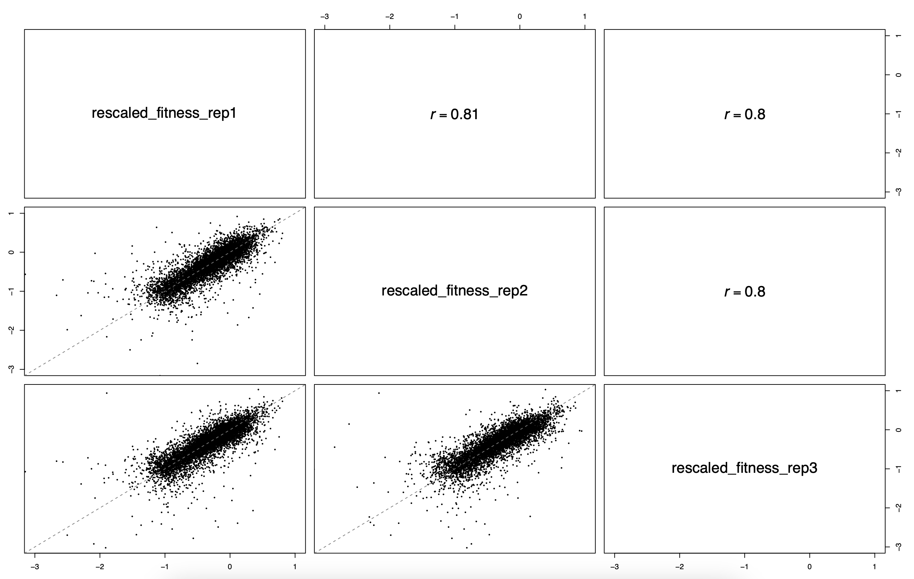

  - `default_results/fitness_heatmap.pdf`: a complete heatmap of absolute mutant counts, stratified by mutant amino acid (Y-axis) per position (X-axis)
    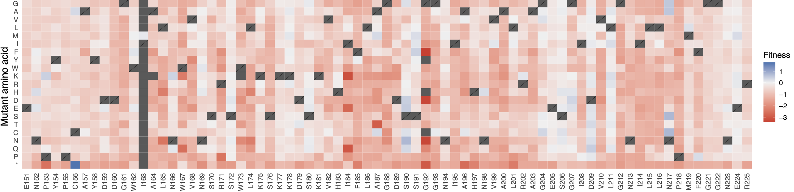

  - `default_results/fitness_estimation.tsv`: table file with all fitness and fitness error estimates calculated
  - `DiMSum_results/dimsum_results/` (optional): subfolder with the full set of [DiMSum](https://github.com/lehner-lab/DiMSum) outputs, including the associated `.HTML` report, `.Rdata` and `.tsv` files with fitness and fitness error estimates

</details>

### Pipeline Info (Nextflow Reports)

- `pipeline_info/`
  - Reports generated by Nextflow: `execution_report.html`, `execution_timeline.html`, `execution_trace.txt` and `pipeline_dag.dot`/`pipeline_dag.svg`.
  - Reports generated by the pipeline: `pipeline_report.html`, `pipeline_report.txt` and `software_versions.yml`. The `pipeline_report*` files will only be present if the `--email` / `--email_on_fail` parameter's are used when running the pipeline.
  - Reformatted samplesheet files used as input to the pipeline: `samplesheet.valid.csv`.
  - Parameters used by the pipeline run: `params.json`.

[Nextflow](https://www.nextflow.io/docs/latest/tracing.html) provides excellent functionality for generating various reports relevant to the running and execution of the pipeline. This will allow you to troubleshoot errors with the running of the pipeline, and also provide you with other information such as launch commands, run times and resource usage.
