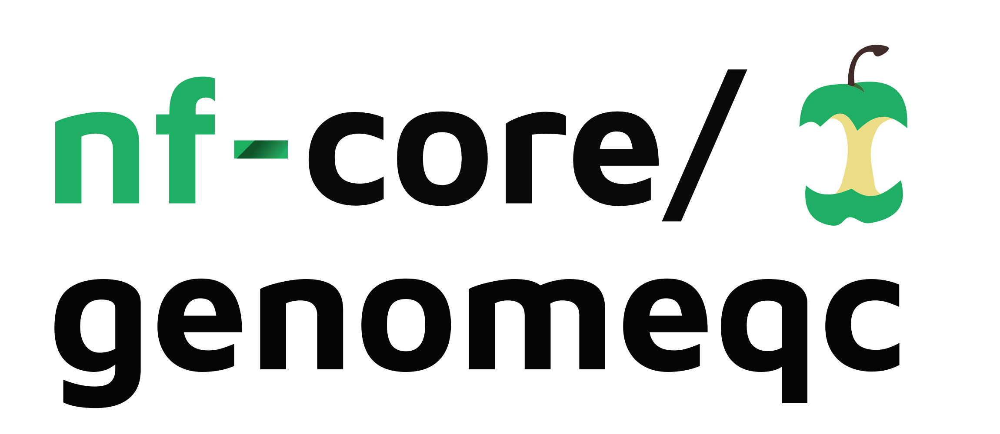
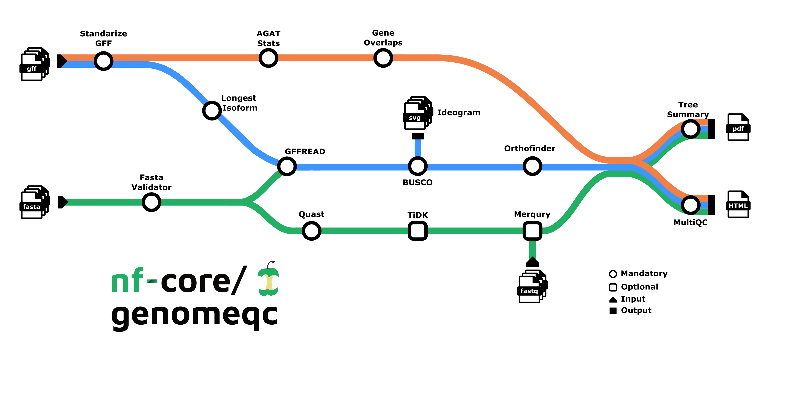

<h1>
  <picture>
    <source media="(prefers-color-scheme: dark)" srcset="docs/images/nf-core-genomeqc_logo_dark.png">
    
  </picture>
</h1>

[](https://github.com/codespaces/new/nf-core/genomeqc)
[](https://github.com/nf-core/genomeqc/actions/workflows/nf-test.yml)
[](https://github.com/nf-core/genomeqc/actions/workflows/linting.yml)[](https://nf-co.re/genomeqc/results)[](https://doi.org/10.5281/zenodo.XXXXXXX)
[](https://www.nf-test.com)

[](https://www.nextflow.io/)
[](https://github.com/nf-core/tools/releases/tag/3.5.1)
[](https://docs.conda.io/en/latest/)
[](https://www.docker.com/)
[](https://sylabs.io/docs/)
[](https://cloud.seqera.io/launch?pipeline=https://github.com/nf-core/genomeqc)

[](https://nfcore.slack.com/channels/genomeqc)[](https://bsky.app/profile/nf-co.re)[](https://mstdn.science/@nf_core)[](https://www.youtube.com/c/nf-core)

## Introduction

**nf-core/genomeqc** is a bioinformatics pipeline that compares the quality of multiple genomes, along with their annotations.

The pipeline takes a list of genomes and annotations (from local files or ncbi accessions), and runs commonly used tools to assess their quality.

Depending on the provided inputs, there are two ways this pipeline can run:

1.  Genome only (minmal run, only fasta files are supplied)
2.  Genome and Annotation (both fasta and gtf/gff files are supplied)

<!-- TODO nf-core:
For an example, see https://github.com/nf-core/rnaseq/blob/master/README.md#introduction
-->



**2. Genome Only:**

1. Downloads the genome files from NCBI: [NCBI genome download](https://github.com/kblin/ncbi-genome-download) - Or you provide your own genomes
2. Describes genome assembly:
   1. [BUSCO](https://busco.ezlab.org/): Evaluates genome completeness based on **single copy markers**.
   2. **BUSCO Ideogram**: Plots the location of markers on the assembly.
   3. [tidk](https://github.com/tolkit/telomeric-identifier) (optional): Indetfies and visualises telomeric repeats.
   4. [QUAST](https://github.com/ablab/quast): Computes contiguity and integrity statistics: N50, N90, GC%, number of sequences.
   5. Contamination screening:
      - [FCS-GX](https://github.com/ncbi/fcs/wiki/FCS-GX-quickstart): Detection and removal of foreign organisms contamination.
      - [FCS-adaptor](https://github.com/ncbi/fcs/wiki/FCS-adaptor-quickstart): Detection and removal of adaptor and vector contamination.
      - [Tiara](https://ibe-uw.github.io/tiara/): DNA sequence classification.
3. Summary with [MultiQC](http://multiqc.info).

**1. Genome and Annotation:**

1. Downloads the genome and gene annotation files from NCBI: [NCBI genome download](https://github.com/kblin/ncbi-genome-download) - Or you provide your own genomes/annotations
2. Describes genome assembly:
   1. [BUSCO](https://busco.ezlab.org/): Evaluates genome completeness based on **single copy markers**.
   2. **BUSCO Ideogram**: Plots the location of markers on the assembly.
   3. [Merqury](https://github.com/marbl/merqury) (optional): Evaluates genome completeness based on sequencing reads.
   4. [tidk](https://github.com/tolkit/telomeric-identifier) (optional): Identifies and visualises telomeric repeats.
   5. [QUAST](https://github.com/ablab/quast): Computes contiguity and integrity statistics: N50, N90, GC%, number of sequences.
   6. Contamination screening:
      - [FCS-GX](https://github.com/ncbi/fcs/wiki/FCS-GX-quickstart): Detection and removal of foreign organisms contamination.
      - [FCS-adaptor](https://github.com/ncbi/fcs/wiki/FCS-adaptor-quickstart): Detection and removal of adaptor and vector contamination.
      - [Tiara](https://ibe-uw.github.io/tiara/): DNA sequence classification.
   7. More options...
3. Describes annotation :
   1. [AGAT](https://agat.readthedocs.io/en/latest/): Number of genes, features, length...
   2. **Gene Overlaps**: Finds the number of overlapping genes.
   3. More options...
4. Extracts longest protein isoform: [GffRead](https://github.com/gpertea/gffread).
5. Finds orthologous genes: [Orthofinder](https://github.com/davidemms/OrthoFinder).
6. Plots an orthology-based phylogenetic tree : **Tee Summary**, as well as other relevant stats from the above steps.
7. Summary with [MultiQC](http://multiqc.info).

> [!WARNING]
> We strongly suggest users to specify the lineage using the `--busco_lineage` parameter, as setting the lineage to `auto` (default value) might cause problems with `BUSCO` during the lineage determination step.

> [!NOTE]
> `BUSCO Ideogram` will only plot those chromosomes -or scaffolds- that contain at least one single copy marker.

<!-- TODO nf-core: Include a figure that guides the user through the major workflow steps. Many nf-core
     workflows use the "tube map" design for that. See https://nf-co.re/docs/guidelines/graphic_design/workflow_diagrams#examples for examples.   -->0

## Usage

> [!NOTE]
> If you are new to Nextflow and nf-core, please refer to [this page](https://nf-co.re/docs/usage/installation) on how to set-up Nextflow. Make sure to [test your setup](https://nf-co.re/docs/usage/introduction#how-to-run-a-pipeline) with `-profile test` before running the workflow on actual data.

First, prepare an input **samplesheet** in **csv format** (e.g. `samplesheet.csv`). You can prepare your sampplesheet using:

### 1. Local files

Simply point out to your local genome assembly and annotation (in FASTA and GFF format, respectively) using the `fasta` and `gff` fields:

```csv
species,refseq,fasta,gff,fastq
species_1,,/path/to/genome.fasta,/path/to/annotation.gff3,
species_2,,/path/to/genome.fasta,/path/to/annotation.gff3,
species_3,,/path/to/genome.fasta,/path/to/annotation.gff3,
```

### 2. ncbi accessions

Additionally, you can run the pipeline using providing ncbi accessions (RefSeq or GenBank, depeding on the mode you wish to run) in the `ncbi` field:

```csv
species,refseq,fasta,gff,fastq
species_1,GCF_000000001.1,,,
species_2,GCF_000000002.1,,,
species_3,GCF_000000003.1,,,
```

### Run the pipeline

<!--
You can mix the two input types **(in development)**.
-->

Run the pipeline using:

```bash
nextflow run nf-core/genomeqc \
   -profile <docker/singularity/.../institute> \
   --input samplesheet.csv \
   --outdir <OUTDIR>
```

You can run the pipeline using a test profile and docker:

```bash
nextflow run nf-core/genomeqc -profile test,docker --outdir ./results
```

<!-- TODO nf-core: update the following command to include all required parameters for a minimal example -->

> [!WARNING]
> Please provide pipeline parameters via the CLI or Nextflow `-params-file` option. Custom config files including those provided by the `-c` Nextflow option can be used to provide any configuration _**except for parameters**_; see [docs](https://nf-co.re/docs/usage/getting_started/configuration#custom-configuration-files).

For more details and further functionality, please refer to the [usage documentation](https://nf-co.re/genomeqc/usage) and the [parameter documentation](https://nf-co.re/genomeqc/parameters).

## Pipeline output

To see the results of an example test run with a full size dataset refer to the [results](https://nf-co.re/genomeqc/results) tab on the nf-core website pipeline page.
For more details about the output files and reports, please refer to the
[output documentation](https://nf-co.re/genomeqc/output).

## Pipeline output

To see the results of an example test run with a full size dataset refer to the [results](https://nf-co.re/genomeqc/results) tab on the nf-core website pipeline page.
For more details about the output files and reports, please refer to the
[output documentation](https://nf-co.re/genomeqc/output).

## Credits

nf-core/genomeqc was originally written by [Chris Wyatt](https://github.com/chriswyatt1) and [Fernando Duarte](https://github.com/FernandoDuarteF) at the University College London.

We thank the following people for their extensive assistance in the development of this pipeline:

- [Mahesh Binzer-Panchal](https://github.com/mahesh-panchal) ([National Bioinformatics Infrastructure Sweden](https://nbis.se/))
- [Usman Rashid](https://github.com/GallVp) ([The New Zealand Institute for Plant and Food Research](https://www.plantandfood.com/en-nz/))
- [Lauren Huet](https://github.com/LaurenHuet) ([Schmidt Ocean Institute](https://schmidtocean.org/))
- [Stephen Turner](https://github.com/stephenturner/) ([Colossal Biosciences](https://colossal.com/))
- [Felipe Perez Cobos](https://github.com/fperezcobos) ([Institute of Agrifood Research and Technology](https://www.irta.cat/en/))
- [Simon Murray](https://github.com/SimonDMurray) ([Nextflow Ambassador](https://www.nextflow.io/our_ambassadors.html))

<!-- TODO nf-core: If applicable, make list of people who have also contributed -->

## Contributions and Support

If you would like to contribute to this pipeline, please see the [contributing guidelines](.github/CONTRIBUTING.md).

For further information or help, don't hesitate to get in touch on the [Slack `#genomeqc` channel](https://nfcore.slack.com/channels/genomeqc) (you can join with [this invite](https://nf-co.re/join/slack)).

## Citations

<!-- TODO nf-core: Add citation for pipeline after first release. Uncomment lines below and update Zenodo doi and badge at the top of this file. -->
<!-- If you use nf-core/genomeqc for your analysis, please cite it using the following doi: [10.5281/zenodo.XXXXXX](https://doi.org/10.5281/zenodo.XXXXXX) -->

<!-- TODO nf-core: Add bibliography of tools and data used in your pipeline -->

An extensive list of references for the tools used by the pipeline can be found in the [`CITATIONS.md`](CITATIONS.md) file.

You can cite the `nf-core` publication as follows:

> **The nf-core framework for community-curated bioinformatics pipelines.**
>
> Philip Ewels, Alexander Peltzer, Sven Fillinger, Harshil Patel, Johannes Alneberg, Andreas Wilm, Maxime Ulysse Garcia, Paolo Di Tommaso & Sven Nahnsen.
>
> _Nat Biotechnol._ 2020 Feb 13. doi: [10.1038/s41587-020-0439-x](https://dx.doi.org/10.1038/s41587-020-0439-x).

python app/downloader-utility.py --clade "Chordata" --project_name "DToL" --data_status "Mapped Reads - Done" --experiment_type "Chromium genome" --download_location "/Users/raheela/Documents" --download_option "assemblies" --species_list "Apamea sordens,Bufo bufo"
