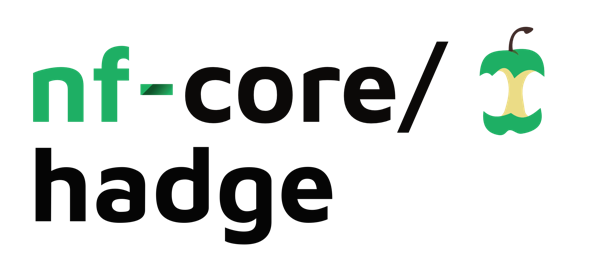
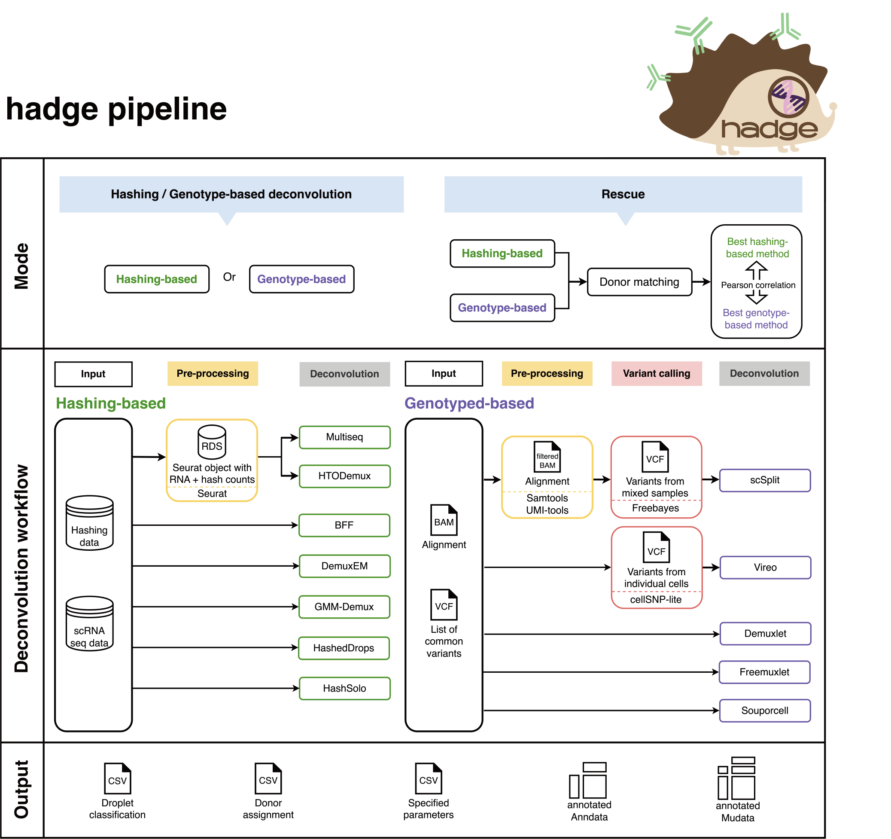

<h1>
  <picture>
    <source media="(prefers-color-scheme: dark)" srcset="docs/images/nf-core-hadge_logo_dark.png">
    
  </picture>
</h1>

[](https://github.com/codespaces/new/nf-core/hadge)
[](https://github.com/nf-core/hadge/actions/workflows/nf-test.yml)
[](https://github.com/nf-core/hadge/actions/workflows/linting.yml)[](https://nf-co.re/hadge/results)[](https://doi.org/10.5281/zenodo.XXXXXXX)
[](https://www.nf-test.com)

[](https://www.nextflow.io/)
[](https://github.com/nf-core/tools/releases/tag/3.5.2)
[](https://docs.conda.io/en/latest/)
[](https://www.docker.com/)
[](https://sylabs.io/docs/)
[](https://cloud.seqera.io/launch?pipeline=https://github.com/nf-core/hadge)

[](https://nfcore.slack.com/channels/hadge)[](https://bsky.app/profile/nf-co.re)[](https://mstdn.science/@nf_core)[](https://www.youtube.com/c/nf-core)

## Introduction

**nf-core/hadge** (**ha**shing **d**econvolution combined with **ge**notype information) is a bioinformatics pipeline that combines 11 methods to perform both hashing- and genotype-based deconvolution on single cell multiplexing data.
It takes a samplesheet with count matrices, BAM and VCF files as input, performs deconvolution with every method, joins all results and finally recovers previously discarded cells by combining the best performing methods (donor matching).



1. Untar matrices
2. Extract hto names from matrix
3. Perform genetic-based deconvolution
   1. Get single cell genotype [`cellSNP`](https://github.com/single-cell-genetics/cellSNP)
   2. [`vireo`](https://github.com/single-cell-genetics/vireo)
   3. [`demuxlet`](https://github.com/statgen/popscle)
   4. [`freemuxlet`](https://github.com/statgen/popscle)
   5. [`souporcell`](https://github.com/wheaton5/souporcell)
4. summarize assignments and classifications
5. Perform hashing-based deconvolution
   1. [`htodemux`](https://satijalab.org/seurat/articles/hashing_vignette)
   2. [`multiseq`](https://satijalab.org/seurat/reference/multiseqdemux)
   3. [`bff`](https://github.com/BimberLab/cellhashR)
   4. [`demuxem`](https://demuxem.readthedocs.io/en/latest/)
   5. [`gmm-demux`](https://github.com/CHPGenetics/GMM-demux)
   6. [`hasheddrops`](https://github.com/MarioniLab/DropletUtils)
   7. [`hashsolo`](https://scanpy.readthedocs.io/en/stable/generated/scanpy.external.pp.hashsolo.html)
6. summarize assignments and classifications
7. Join all results
8. Donor match
9. Find informative variants
10. Create AnnData and Mudata objects
11. [`MultiQC`](http://multiqc.info/)

## Usage

> [!NOTE]
> If you are new to Nextflow and nf-core, please refer to [this page](https://nf-co.re/docs/usage/installation) on how to set-up Nextflow. Make sure to [test your setup](https://nf-co.re/docs/usage/introduction#how-to-run-a-pipeline) with `-profile test` before running the workflow on actual data. The profile `test` is used to test hadge's rescue mode, but you can also test the other modes with the profiles `test_genetic`, `test_hashing` and `test_donor_match`.

First, prepare a samplesheet with your input data that looks as follows:

`samplesheet.csv`:

```csv
sample,rna_matrix,hto_matrix,bam,vcf,n_samples,barcodes
id1,rna.tar.gz,hto.tar.gz,chr21.bam,donor_genotype_chr21.vcf,2,barcodes.tsv
id2,rna.tar.gz,hto.tar.gz,chr21.bam,donor_genotype_chr21.vcf,2,barcodes.tsv
id3,rna.tar.gz,hto.tar.gz,chr21.bam,donor_genotype_chr21.vcf,2,barcodes.tsv
```

Each row contains data from a single-cell multiplexing experiment. The RNA-seq (`rna_matrix`) and hashing (`hto_matrix`) count matrices are provided in a 10x Genomics format and compressed as `.tar.gz`.
Genetic deconvolution requires both the alignment file (`bam`) and a list of common SNPs (`vcf`). Users must specify the number of multiplexed donors (`n_samples`) and identify the target cells for deconvolution (`barcodes`).

Now, you can run the pipeline using:

```bash
nextflow run nf-core/hadge \
   -profile <docker/singularity/.../institute> \
   --input samplesheet.csv \
   --outdir <OUTDIR> \
   --mode rescue \
   --hash_tools htodemux,hasheddrops,multiseq,gmm-demux,bff,hashsolo \
   --genetic_tools demuxlet,freemuxlet,vireo,souporcell \
   --fasta <FASTADIR>
```

> [!WARNING]
> Please provide pipeline parameters via the CLI or Nextflow `-params-file` option. Custom config files including those provided by the `-c` Nextflow option can be used to provide any configuration _**except for parameters**_; see [docs](https://nf-co.re/docs/usage/getting_started/configuration#custom-configuration-files).

For more details and further functionality, please refer to the [usage documentation](https://nf-co.re/hadge/usage) and the [parameter documentation](https://nf-co.re/hadge/parameters).

## Pipeline output

To see the results of an example test run with a full size dataset refer to the [results](https://nf-co.re/hadge/results) tab on the nf-core website pipeline page.
For more details about the output files and reports, please refer to the
[output documentation](https://nf-co.re/hadge/output).

## Credits

nf-core/hadge was originally written by Fabiola Curion ([@bio-la](https://github.com/bio-la)), Xichen Wu ([@wxicu](https://github.com/wxicu)), Lukas Heumos ([@zethson](https://github.com/Zethson)) and Mariana Gonzales Andre ([@mari-ga](https://github.com/mari-ga)).

We thank the following people for their extensive assistance in the development of this pipeline:

- [Luis Heinzlmeier](https://github.com/LuisHeinzlmeier)
- [Nico Trummer](https://github.com/nictru)
- [Seo Hyon Kim](https://github.com/seohyonkim)
<!-- TODO nf-core: If applicable, make list of people who have also contributed -->

## Contributions and Support

If you would like to contribute to this pipeline, please see the [contributing guidelines](.github/CONTRIBUTING.md).

For further information or help, don't hesitate to get in touch on the [Slack `#hadge` channel](https://nfcore.slack.com/channels/hadge) (you can join with [this invite](https://nf-co.re/join/slack)).

## Citations

<!-- TODO nf-core: Add citation for pipeline after first release. Uncomment lines below and update Zenodo doi and badge at the top of this file. -->
<!-- If you use nf-core/hadge for your analysis, please cite it using the following doi: [10.5281/zenodo.XXXXXX](https://doi.org/10.5281/zenodo.XXXXXX) -->

<!-- TODO nf-core: Add bibliography of tools and data used in your pipeline -->

An extensive list of references for the tools used by the pipeline can be found in the [`CITATIONS.md`](CITATIONS.md) file.

You can cite the `nf-core` publication as follows:

> **The nf-core framework for community-curated bioinformatics pipelines.**
>
> Philip Ewels, Alexander Peltzer, Sven Fillinger, Harshil Patel, Johannes Alneberg, Andreas Wilm, Maxime Ulysse Garcia, Paolo Di Tommaso & Sven Nahnsen.
>
> _Nat Biotechnol._ 2020 Feb 13. doi: [10.1038/s41587-020-0439-x](https://dx.doi.org/10.1038/s41587-020-0439-x).
