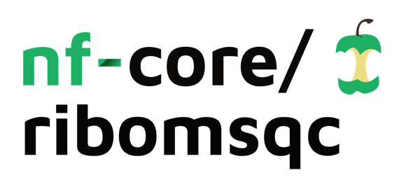
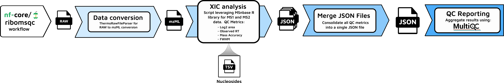

<h1>
  <picture>
    <source media="(prefers-color-scheme: dark)" srcset="docs/images/nf-core-ribomsqc_logo_dark.png">
    
  </picture>
</h1>

[](https://github.com/codespaces/new/nf-core/ribomsqc)
[](https://github.com/nf-core/ribomsqc/actions/workflows/nf-test.yml)
[](https://github.com/nf-core/ribomsqc/actions/workflows/linting.yml)[](https://nf-co.re/ribomsqc/results)[](https://doi.org/10.5281/zenodo.PENDING)
[](https://www.nf-test.com)

[](https://www.nextflow.io/)
[](https://github.com/nf-core/tools/releases/tag/3.5.1)
[](https://docs.conda.io/en/latest/)
[](https://www.docker.com/)
[](https://sylabs.io/docs/)
[](https://cloud.seqera.io/launch?pipeline=https://github.com/nf-core/ribomsqc)

[](https://nfcore.slack.com/channels/ribomsqc)[](https://bsky.app/profile/nf-co.re)[](https://mstdn.science/@nf_core)[](https://www.youtube.com/c/nf-core)

### Introduction

Use **nf-core/ribomsqc** to:

- Perform automated quality control of ribonucleoside analysis by mass spectrometry.
- Summarize and visualize QC metrics through integrated **MultiQC** reports.


**Figure 1:** General workflow overview showing the pipeline steps from RAW file input through ThermoRawFileParser conversion, MSNBase XIC extraction, JSON merging, to final MultiQC report generation.


**Figure 2:** Detailed workflow diagram illustrating the data flow and process connections in the ribomsqc pipeline.

## Usage

> \[!NOTE]
> If you are new to Nextflow and nf-core, please refer to [this page](https://nf-co.re/docs/usage/installation) on how to set-up Nextflow.

1. **Prepare a samplesheet** with your input data, for example:

   ```csv title="samplesheet.csv"
   id,raw_file
   Day_5,path/to/Day_5.raw
   ```

For more information, see the [usage docs](https://nf-co.re/ribomsqc/usage) on required `samplesheet.csv` columns.

2. **Prepare an analytes TSV file** (e.g. `qcn1.tsv`) with your compounds and theoretical retention times. The TSV must have **exactly** these columns and format:

```tsv
short_name	long_name	mz_M0	mz_M1	mz_M2	ms2_mz	rt_teoretical
C	Cytidine 50 μg/mL	244.0928			112.0505	555
U	Uridine 25 μg/mL	245.0768			113.0346	1566
m3C	3-Methylcytidine methosulfate 100 μg/mL	258.1084			126.0662	508
m5C	5-Methylcytidine 100 μg/mL	258.1084			126.0662	655
Cm	2-O-Methylcytidine 20 μg/mL	258.1084			112.0505	883
m5U	5-Methyluridine 50 μg/mL	259.0925			127.0502	1866
I	Inosine 25 μg/mL	269.088			137.0458	1741
m1A	1-Methyladenosine 25 μg/mL	282.1197			150.0774	523
G	Guanosine 25 μg/mL	284.0989			152.0567	1726
m7G	7-Methylguanosine 25 μg/mL	298.1146			166.0723	554
```

> [!NOTE]
> Replace **only** the values in the `rt_teoretical` column with **your own** retention times (in seconds) for each compound.

3. **Run the pipeline**:

   ```bash
   nextflow run nf-core/ribomsqc \
     --input samplesheet.csv \
     --analytes_tsv qcn1.tsv \
     --analyte all \
     --rt_tolerance 120 \
     --mz_tolerance 7 \
     --ms_level 1 \
     --outdir results \
     -profile singularity
   ```

> [!WARNING]
> Please provide pipeline parameters via the CLI or Nextflow `-params-file` option.

For more information, see the [usage docs](https://nf-co.re/ribomsqc/usage) and [parameters](https://nf-co.re/ribomsqc/parameters).

## Pipeline output

See [results page](https://nf-co.re/ribomsqc/results) for example output and [output docs](https://nf-co.re/ribomsqc/output).

## Credits

nf-core/ribomsqc was originally written by Roger Olivella.

## Contributions and Support

For help, visit [Slack #ribomsqc](https://nfcore.slack.com/channels/ribomsqc) or see [contributing guide](.github/CONTRIBUTING.md).

## Citations

See [`CITATIONS.md`](CITATIONS.md) for tool references.

> Ewels PA _et al._ (2020) _The nf-core framework_. Nat Biotechnol. [doi:10.1038/s41587-020-0439-x](https://doi.org/10.1038/s41587-020-0439-x)
