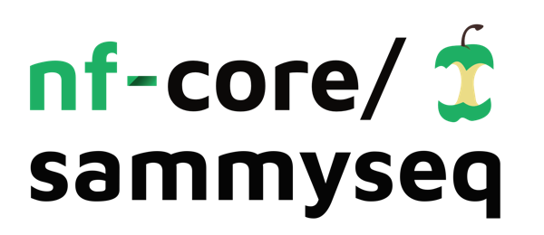
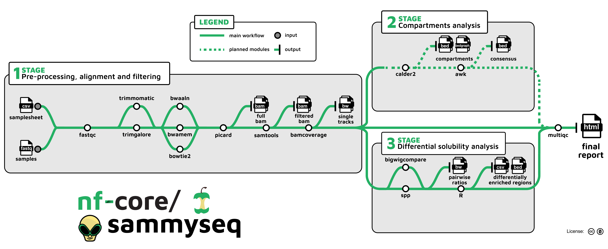

<h1>
  <picture>
    <source media="(prefers-color-scheme: dark)" srcset="docs/images/nf-core-sammyseq_logo_dark.png">
    
  </picture>
</h1>

[](https://github.com/codespaces/new/nf-core/sammyseq)
[](https://github.com/nf-core/sammyseq/actions/workflows/nf-test.yml)
[](https://github.com/nf-core/sammyseq/actions/workflows/linting.yml)[](https://nf-co.re/sammyseq/results)[](https://doi.org/10.5281/zenodo.XXXXXXX)
[](https://www.nf-test.com)

[](https://www.nextflow.io/)
[](https://github.com/nf-core/tools/releases/tag/3.4.1)
[](https://docs.conda.io/en/latest/)
[](https://www.docker.com/)
[](https://sylabs.io/docs/)
[](https://cloud.seqera.io/launch?pipeline=https://github.com/nf-core/sammyseq)

[](https://nfcore.slack.com/channels/sammyseq)[](https://bsky.app/profile/nf-co.re)[](https://mstdn.science/@nf_core)[](https://www.youtube.com/c/nf-core)

## Introduction

**nf-core/sammyseq** is a bioinformatics pipeline for the analysis of Sequential Analysis of MacroMolecules accessibilitY sequencing (SAMMY-seq) data, a cheap and effective methodology to analyze chromatin state as described in:

> Lucini, F., Petrini, C., Salviato, E., Pal, K., Rosti, V., Gorini, F., Santarelli, P., Quadri, R., Lembo, G., Graziano, G., Di Patrizio Soldateschi, E., Tagliaferri, I., Pinatel, E., Sebestyén, E., Rotta, L., Gentile, F., Vaira, V., Lanzuolo, C., Ferrari, F., 2024. Biochemical properties of chromatin domains define genome compartmentalization. Nucleic Acids Research 52, e54–e54. [doi](https://doi.org/10.1093/nar/gkae454) [pubmed](https://pubmed.ncbi.nlm.nih.gov/38808669/)

> Sebestyén, E., Marullo, F., Lucini, F., Petrini, C., Bianchi, A., Valsoni, S., Olivieri, I., Antonelli, L., Gregoretti, F., Oliva, G., Ferrari, F., Lanzuolo, C., 2020. SAMMY-seq reveals early alteration of heterochromatin and deregulation of bivalent genes in Hutchinson-Gilford Progeria Syndrome. Nature Communications 11, 6274. [doi](https://doi.org/10.1038/s41467-020-20048-9) [pubmed](https://pubmed.ncbi.nlm.nih.gov/33293552/)

> [!WARNING]
> Please note that this pipeline is under active development and has not been released yet.

Here is an outline of the analysis steps:

1. Read QC ([`FastQC`](https://www.bioinformatics.babraham.ac.uk/projects/fastqc/))
2. Trim reads to remove adapter sequences and low quality ends ([`Trim Galore!`](https://www.bioinformatics.babraham.ac.uk/projects/trim_galore) or [`Trimmomatic`](http://www.usadellab.org/cms/?page=trimmomatic))
3. Align on a reference genome ([`BWA`](https://bio-bwa.sourceforge.net/) or [`Bowtie 2`](https://bowtie-bio.sourceforge.net/bowtie2))
4. Mark duplicate reads ([`picard Markduplicates`](http://broadinstitute.github.io/picard))
5. Filter reads and generate alignment statistics ([`samtools`](http://www.htslib.org/))
6. Create single track profiles in bigwig format ([`deeptools bamCoverage`](https://deeptools.readthedocs.io/en/latest/))
7. (Optional) Generate pairwise comparison tracks in bigWig format ([`spp`](https://github.com/hms-dbmi/spp)) or ([`deeptools bigwigCompare`](https://deeptools.readthedocs.io/en/develop/content/tools/bigwigCompare.html)).
8. (Optional) Identify differentially enriched solubility regions as described in [Wang et al., 2024 ](https://doi.org/10.1038/s41594-025-01622-5).
9. Generate an analysis report by collecting all generated QC and statistics ([`MultiQC`](http://multiqc.info/))

<p align="center">
    
</p>

## Usage

> [!NOTE]
> If you are new to Nextflow and nf-core, please refer to [this page](https://nf-co.re/docs/usage/installation) on how to set-up Nextflow. Make sure to [test your setup](https://nf-co.re/docs/usage/introduction#how-to-run-a-pipeline) with `-profile test` before running the workflow on actual data.

First, prepare a samplesheet with your input data that looks as follows:

`samplesheet.csv`:

```csv
sample,fastq_1,fastq_2,experimentalID,fraction,sample_group
CTRL004_S2,/home/sammy/test_data/CTRL004_S2_chr22only.fq.gz,,CTRL004,S2,CTRL
CTRL004_S3,/home/sammy/test_data/CTRL004_S3_chr22only.fq.gz,,CTRL004,S3,CTRL
CTRL004_S4,/home/sammy/test_data/CTRL004_S4_chr22only.fq.gz,,CTRL004,S4,CTRL
```

Each row represents a fastq file (single-end) or a pair of fastq files (paired end), `experimentalID` represents the biological specimen of interest and `sample` the library produced for each fraction, it usually is a unique combination of `experimentalID` and `fraction`. The `sample_group` field is used to group samples that belong to the same biological condition.

Now, you can run the pipeline using:

```bash
nextflow run nf-core/sammyseq \
   -profile <docker/singularity/.../institute> \
   --fasta reference_genome.fa \
   --input samplesheet.csv \
   --outdir <OUTDIR>
```

or

```bash
nextflow run nf-core/sammyseq \
   -profile <docker/singularity/.../institute> \
   --fasta reference_genome.fa \
   --input samplesheet.csv \
   --outdir <OUTDIR> \
   --comparison S2SvsS3
```

> [!WARNING]
> Please provide pipeline parameters via the CLI or Nextflow `-params-file` option. Custom config files including those provided by the `-c` Nextflow option can be used to provide any configuration _**except for parameters**_; see [docs](https://nf-co.re/docs/usage/getting_started/configuration#custom-configuration-files).

For more details and further functionality, please refer to the [usage documentation](https://nf-co.re/sammyseq/usage) and the [parameter documentation](https://nf-co.re/sammyseq/parameters).

## Pipeline output

<!-- TODO uncomment after first release: To see the results of an example test run with a full size dataset refer to the [results](https://nf-co.re/sammyseq/results) tab on the nf-core website pipeline page. -->

For more details about the output files and reports, please refer to the
[output documentation](https://nf-co.re/sammyseq/output).

## Credits

The SAMMY-seq data analysis procedure was originally developed by the laboratory of Francesco Ferrari (IFOM-ETS, Milan; IGM-CNR, Pavia) in collaboration with the laboratory of Chiara Lanzuolo (INGM, Milan; ITB-CNR, Segrate).
The orginal pipeline backbone was mainly the result of work by Cristiano Petrini (IFOM) and Endre Sebestyén (IFOM), with significant contributions by Ilario Tagliaferri (IFOM), Giovanni Lembo (IFOM) and Emanuele Di Patrizio Soldateschi (INGM). The project also benefited from the collaboration and input by Eva Maria Pinatel (ITB-CNR). The product of this effort resulted in a first pipeline implemented in bash and adapted to work on Sun Grid Engine (SGE) scheduler.

The nf-core pipeline (nf-core/sammyseq) is being implemented by [Lucio Di Filippo](https://github.com/lucidif) (ISASI-CNR, Pozzuoli; IBBTEC, Santander), [Ugo Maria Iannacchero](https://github.com/ugoiannacchero) (ITB-CNR), [Nadia Sanseverino](https://github.com/nadiaxaidan) (ISASI-CNR) and [Margherita Mutarelli](https://github.com/daisymut) (ISASI-CNR).

<!-- We thank the following people for their extensive assistance in the development of this pipeline: -->

Many thanks to others who have helped out and contributed along the way too, including (but not limited to): [Phil Ewels](https://github.com/ewels), [Maxime Ulysse Garcia](https://github.com/maxulysse), [Friederike Hanssen](https://github.com/FriederikeHanssen), [Matthias Hörtenhuber](https://github.com/mashehu), [Marinicla Pascale](https://github.com/Marinicla), [Júlia Mir-Pedrol](https://github.com/mirpedrol) and [Marcel Ribeiro-Dantas](https://github.com/mribeirodantas).

## Acknowledgements

The development of this pipeline was made possible thanks to the projects Progetti@CNR Myo-CoV-2 B93C20046330005, AFM Téléthon EDMD-GenomeSCAN B53C22009260007 and PIR01_00011 I.Bi.S.Co. Infrastruttura per Big data e Scientific COmputing (PON 2014-2020).

## Contributions and Support

If you would like to contribute to this pipeline, please see the [contributing guidelines](.github/CONTRIBUTING.md).

For further information or help, don't hesitate to get in touch on the [Slack `#sammyseq` channel](https://nfcore.slack.com/channels/sammyseq) (you can join with [this invite](https://nf-co.re/join/slack)).

## Citations

<!-- If you use nf-core/sammyseq for your analysis, please cite it using the following doi: [10.5281/zenodo.XXXXXX](https://doi.org/10.5281/zenodo.XXXXXX) -->

<!-- nf-core: Add bibliography of tools and data used in your pipeline -->

An extensive list of references for the tools used by the pipeline can be found in the [`CITATIONS.md`](CITATIONS.md) file.

You can cite the `nf-core` publication as follows:

> **The nf-core framework for community-curated bioinformatics pipelines.**
>
> Philip Ewels, Alexander Peltzer, Sven Fillinger, Harshil Patel, Johannes Alneberg, Andreas Wilm, Maxime Ulysse Garcia, Paolo Di Tommaso & Sven Nahnsen.
>
> _Nat Biotechnol._ 2020 Feb 13. doi: [10.1038/s41587-020-0439-x](https://dx.doi.org/10.1038/s41587-020-0439-x).
