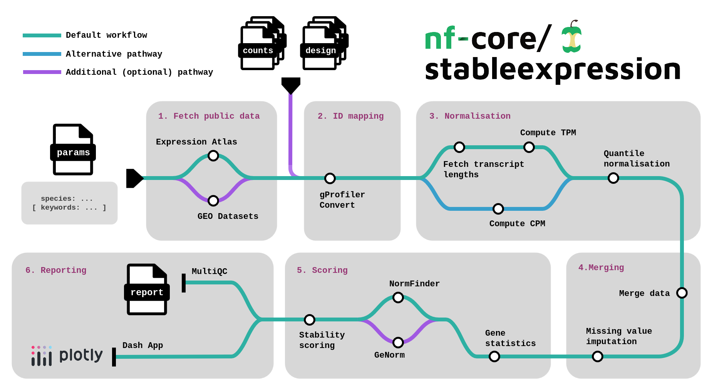

<h1>
  <picture>
    <source media="(prefers-color-scheme: dark)" srcset="docs/images/nf-core-stableexpression_logo_dark.png">
    
  </picture>
</h1>

[](https://github.com/codespaces/new/nf-core/stableexpression)
[](https://github.com/nf-core/stableexpression/actions/workflows/nf-test.yml)
[](https://github.com/nf-core/stableexpression/actions/workflows/linting.yml)[](https://nf-co.re/stableexpression/results)[](https://doi.org/10.5281/zenodo.XXXXXXX)
[](https://www.nf-test.com)

[](https://www.nextflow.io/)
[](https://github.com/nf-core/tools/releases/tag/3.5.1)
[](https://apptainer.org/)
[](https://docs.conda.io/en/latest/)
[](https://www.docker.com/)
[](https://sylabs.io/docs/)
[](https://cloud.seqera.io/launch?pipeline=https://github.com/nf-core/stableexpression)

[](https://nfcore.slack.com/channels/stableexpression)[](https://bsky.app/profile/nf-co.re)[](https://mstdn.science/@nf_core)[](https://www.youtube.com/c/nf-core)

## Introduction

**nf-core/stableexpression** is a bioinformatics pipeline aiming to aggregate multiple count datasets for a specific species and find the most stable genes. The datasets can be either downloaded from public databases (EBI, NCBI) or provided directly by the user. Both RNA-seq and Microarray count datasets can be utilised.

<p align="center">
    
</p>

It takes as main inputs :

- a species name (mandatory)
- keywords for Expression Atlas / GEO search (optional)
- a CSV input file listing your own raw / normalised count datasets (optional).

**Use cases**:

- **find the most suitable genes as RT-qPCR reference genes for a specific species (and optionally specific conditions)**
- download all Expression Atlas and / or NCBI GEO datasets for a species (and optionally keywords)

## Pipeline overview

The pipeline is built using [Nextflow](https://www.nextflow.io/) and processes data using the following steps:

#### 1. Get accessions from public databases

- Get [Expression Atlas](https://www.ebi.ac.uk/gxa/home) dataset accessions corresponding to the provided species (and optionally keywords)
  This step is run by default but is optional. Set `--skip_fetch_eatlas_accessions` to skip it.
- Get NBCI [GEO](https://www.ncbi.nlm.nih.gov/gds) **microarray** dataset accessions corresponding to the provided species (and optionally keywords)
  This is optional and **NOT** run by default. Set `--fetch_geo_accessions` to run it.

#### 2. Download data (see [usage](conf/usage.md#3-provide-your-own-accessions))

- Download [Expression Atlas](https://www.ebi.ac.uk/gxa/home) data if any
- Download NBCI [GEO](https://www.ncbi.nlm.nih.gov/gds) data if any

> [!NOTE]
> At this point, datasets downloaded from public databases are merged with datasets provided by the user using the `--datasets` parameter. See [usage](conf/usage.md#4-use-your-own-expression-datasets) for more information about local datasets.

#### 3. ID Mapping (see [usage](conf/usage.md#5-custom-gene-id-mapping--metadata))

- Gene IDs are cleaned
- Map gene IDS to NCBI Entrez Gene IDS (or Ensembl IDs) for standardisation among datasets using [g:Profiler](https://biit.cs.ut.ee/gprofiler/gost) (run by default; optional)
- Rare genes are filtered out

#### 4. Sample filtering

Samples that show too high ratios of zeros or missing values are removed from the analysis.

#### 5. Normalisation of expression

- Normalize RNAseq raw data using TPM (necessitates downloading the corresponding genome and computing transcript lengths) or CPM.
- Perform quantile normalisation on each dataset separately using [scikit-learn](https://scikit-learn.org/stable/modules/generated/sklearn.preprocessing.quantile_transform.html)

#### 6. Merge all data

All datasets are merged into one single dataframe.

#### 7. Imputation of missing values

Missing values are replaced by imputed values using a specific algorithm provided by [scikit-learn](https://scikit-learn.org/stable/modules/generated/sklearn.preprocessing.quantile_transform.html). The user can choose the method of imputation with the `--missing_value_imputer` parameter.

#### 8. General statistics for each gene

Base statistics are computed for each gene, platform-wide and for each platform (RNAseq and microarray).

#### 9. Scoring

- The whole list of genes is divided in multiple sections, based on their expression level.
- Based on the coefficient of variation, a shortlist of candidates genes is extracted for each section.
- Run optimised, scalable version of [Normfinder](https://www.moma.dk/software/normfinder)
- Run optimised, scalable version of [Genorm](https://genomebiology.biomedcentral.com/articles/10.1186/gb-2002-3-7-research0034) (run by default; optional)
- Compute stability scores for each candidate gene

#### 10. Reporting

- Result aggregation
- Make [`MultiQC`](http://multiqc.info/) report
- Prepare [Dash Plotly](https://dash.plotly.com/) app for further investigation of gene / sample counts

## Basic usage

> [!NOTE]
> If you are new to Nextflow and nf-core, please refer to [this page](https://nf-co.re/docs/usage/installation) on how to set-up Nextflow. Make sure to [test your setup](https://nf-co.re/docs/usage/introduction#how-to-run-a-pipeline) with `-profile test` before running the workflow on actual data.

To search the most stable genes in a species considering all public datasets, simply run:

```bash
nextflow run nf-core/stableexpression \
   -profile <PROFILE (examples: docker / apptainer / conda / micromamba)> \
   --species <SPECIES (examples: arabidopsis_thaliana / "drosophila melanogaster")> \
   --outdir <OUTDIR (example: ./results)> \
   -resume
```

## More advanced usage

For more specific scenarios, like:

- **fetching only specific conditions**
- **using your own expression dataset(s)**

please refer to the [usage documentation](https://nf-co.re/stableexpression/usage).

## Resource allocation

For setting pipeline CPU / memory usage, see [here](docs/configuration.md).

## Profiles

See [here](https://nf-co.re/stableexpression/usage#profiles) for more information about profiles.

## Pipeline output

To see the results of an example test run with a full size dataset refer to the [results](https://nf-co.re/stableexpression/results) tab on the nf-core website pipeline page.
For more details about the output files and reports, please refer to the
[output documentation](https://nf-co.re/stableexpression/output).

## Support us

If you like nf-core/stableexpression, please make sure you give it a star on GitHub!

[](https://github.com/nf-core/stableexpression)

## Credits

nf-core/stableexpression was originally written by Olivier Coen.

We thank the following people for their assistance in the development of this pipeline:

- Rémy Costa

## Contributions and Support

If you would like to contribute to this pipeline, please see the [contributing guidelines](.github/CONTRIBUTING.md).

For further information or help, don't hesitate to get in touch on the [Slack `#stableexpression` channel](https://nfcore.slack.com/channels/stableexpression) (you can join with [this invite](https://nf-co.re/join/slack)).

## Citations

<!-- TODO nf-core: Add citation for pipeline after first release. Uncomment lines below and update Zenodo doi and badge at the top of this file. -->
<!-- If you use nf-core/stableexpression for your analysis, please cite it using the following doi: [10.5281/zenodo.XXXXXX](https://doi.org/10.5281/zenodo.XXXXXX) -->

An extensive list of references for the tools used by the pipeline can be found in the [`CITATIONS.md`](CITATIONS.md) file.

You can cite the `nf-core` publication as follows:

> **The nf-core framework for community-curated bioinformatics pipelines.**
>
> Philip Ewels, Alexander Peltzer, Sven Fillinger, Harshil Patel, Johannes Alneberg, Andreas Wilm, Maxime Ulysse Garcia, Paolo Di Tommaso & Sven Nahnsen.
>
> _Nat Biotechnol._ 2020 Feb 13. doi: [10.1038/s41587-020-0439-x](https://dx.doi.org/10.1038/s41587-020-0439-x).
